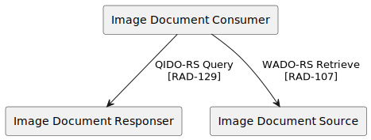
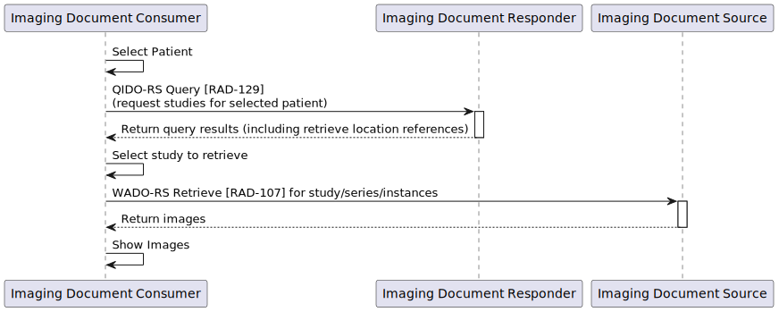
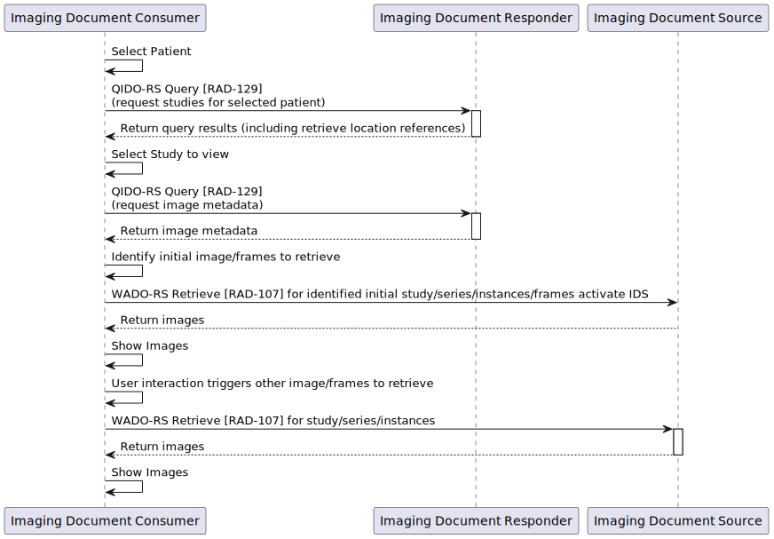
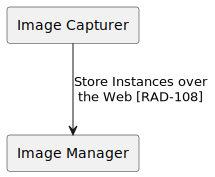

### DICOMweb

[DICOMWeb - Wikipedia](https://en.wikipedia.org/wiki/DICOMweb)
> DICOMweb is a term applied to the family of RESTful DICOM services defined for sending, retrieving and querying for
> medical images and related information.
>
> The intent is to provide a light-weight mobile device and web browser friendly mechanism for accessing images, which
> can be implemented by developers who have minimal familiarity with the DICOM standard and which uses consumer
> application friendly mechanisms like http, JSON and media types (like "image/jpeg") to the maximum extent possible.

[dicomstandard.org NEMA/MITA](https://www.dicomstandard.org/using/dicomweb)
> DICOMweb™ is the DICOM Standard for web-based medical imaging. It is a set of RESTful services, enabling web
> developers to unlock the power of healthcare images using industry-standard toolsets. DICOMweb can be implemented
> directly or as a proxy to the DIMSE services to offer modern web-based access to DICOM-enabled systems.
> Image-producing modalities don’t all need to be retrofitted to support DICOMweb.

DICOMweb [DICOM PS3.18](https://dicom.nema.org/medical/dicom/current/output/html/part18.html) | DIMSE service [DICOM PS3.4](https://dicom.nema.org/medical/dicom/current/output/html/part04.html)
-- | --
[Store DICOM objects (STOW-RS)](https://dicom.nema.org/medical/dicom/current/output/html/part18.html#sect_10.5) | [Storage Service Class (C-STORE)](https://dicom.nema.org/medical/dicom/current/output/html/part04.html#chapter_B)
[Search for DICOM objects (QIDO-RS)](https://dicom.nema.org/medical/dicom/current/output/html/part18.html#sect_10.6) | [Study Root Query/Retrieve Information Model - FIND SOP Class](https://dicom.nema.org/medical/dicom/current/output/html/part04.html#sect_C.4.1)
[Retrieve DICOM objects (WADO-RS)](https://dicom.nema.org/medical/dicom/current/output/html/part18.html#sect_10.4) | [Study Root Query/Retrieve Information Model - GET SOP Class](https://dicom.nema.org/medical/dicom/current/output/html/part04.html#sect_C.4.3)
[Manage worklist items (UPS-RS)](https://dicom.nema.org/medical/dicom/current/output/html/part18.html#chapter_11) | [Unified Procedure Step Service and SOP Classes](https://dicom.nema.org/medical/dicom/current/output/html/part04.html#chapter_CC)
[Store Non-Patient objects](https://dicom.nema.org/medical/dicom/current/output/html/part18.html#sect_12.5) | [Non-Patient Object Storage Service Class (C-STORE)](https://dicom.nema.org/medical/dicom/current/output/html/part04.html#chapter_GG)
[Search for Color Palettes](https://dicom.nema.org/medical/dicom/current/output/html/part18.html#sect_12.6) | [Color Palette Information Model - FIND SOP Class](https://dicom.nema.org/medical/dicom/current/output/html/part04.html#sect_X.4.1)
[Search for Defined Procedure Protocols](https://dicom.nema.org/medical/dicom/current/output/html/part18.html#sect_12.6) | [Defined Procedure Protocol Information Model - FIND SOP Class](https://dicom.nema.org/medical/dicom/current/output/html/part04.html#sect_HH.4.1)
[Search for Hanging Protocols](https://dicom.nema.org/medical/dicom/current/output/html/part18.html#sect_12.6) | [Hanging Protocol Information Model - FIND SOP Class](https://dicom.nema.org/medical/dicom/current/output/html/part04.html#sect_U.4.1)
[Search for Implant Templates](https://dicom.nema.org/medical/dicom/current/output/html/part18.html#sect_12.6) | [Generic Implant Template Information Model - FIND SOP Class](https://dicom.nema.org/medical/dicom/current/output/html/part04.html#sect_BB.4.1)
[Search for Inventories](https://dicom.nema.org/medical/dicom/current/output/html/part18.html#sect_12.6) | [Inventory FIND SOP Class](https://dicom.nema.org/medical/dicom/current/output/html/part04.html#sect_JJ.3.1)
[Retrieve Color Palettes](https://dicom.nema.org/medical/dicom/current/output/html/part18.html#sect_12.4) | [Color Palette Information Model - GET SOP Class](https://dicom.nema.org/medical/dicom/current/output/html/part04.html#sect_X.4.3)
[Retrieve Defined Procedure Protocols](https://dicom.nema.org/medical/dicom/current/output/html/part18.html#sect_12.4) | [Defined Procedure Protocol Information Model - GET SOP Class](https://dicom.nema.org/medical/dicom/current/output/html/part04.html#sect_HH.4.3)
[Retrieve Hanging Protocols](https://dicom.nema.org/medical/dicom/current/output/html/part18.html#sect_12.4) | [Hanging Protocol Information Model - GET SOP Class](https://dicom.nema.org/medical/dicom/current/output/html/part04.html#sect_U.4.3)
[Retrieve Implant Templates](https://dicom.nema.org/medical/dicom/current/output/html/part18.html#sect_12.4) | [Generic Implant Template Information Model - GET SOP Class](https://dicom.nema.org/medical/dicom/current/output/html/part04.html#sect_BB.4.3)
[Retrieve Inventories](https://dicom.nema.org/medical/dicom/current/output/html/part18.html#sect_12.4) | [Inventory GET SOP Class](https://dicom.nema.org/medical/dicom/current/output/html/part04.html#sect_JJ.3.3)
[Retrieve Capabilities (WADL)](https://dicom.nema.org/medical/dicom/current/output/html/part18.html#sect_8.9) |

### History
- 2003: [Supp 85: Web Access to DICOM Objects (WADO)](https://dicom.nema.org/medical/dicom/Final/sup85_ft.pdf)
- 2010: [Medical Imaging Network Transport (MINT)](https://studylib.net/doc/5441544/mint-conformance---medical-imaging-network-transport)
- 2011: [Supp 148: WADO by means of Web Services (WADO-WS)](https://dicom.nema.org/medical/dicom/Final/sup161_ft.pdf)
- 2011: [Supp 161: WADO by means of RESTful Services (WADO-RS)](https://dicom.nema.org/medical/dicom/Final/sup161_ft.pdf)
- 2011: [Supp 163: Store Over the Web by RESTful Services (STOW-RS)](https://dicom.nema.org/medical/dicom/Final/sup163_ft3.pdf)
- 2011: [Supp 166: Query based on ID for DICOM Objects by RESTful Services (QIDO-RS)](https://dicom.nema.org/medical/dicom/Final/sup166_ft5.pdf)
- 2014: [Supp 171: Unified Procedure Step by REpresentational State Transfer (REST) Services](https://dicom.nema.org/medical/dicom/Final/sup172_ft2.pdf)
- 2015: [Supp 174: RESTful Rendering](https://dicom.nema.org/medical/dicom/Final/sup174_ft.pdf)
- 2016: [Supp 194: RESTful Services for Non-Patient Instances](https://dicom.nema.org/medical/dicom/Final/sup194_ft.pdf)
- 2017: [Supp 198: Retirement of WADO-WS](https://dicom.nema.org/medical/dicom/Final/sup198_ft2_retire_wado-ws.pdf)
- 2019: [Supp 183: PS3.18 Web Services Re-Documentation](https://dicom.nema.org/medical/dicom/Final/sup183_ft_part18_redoc.pdf)
(Introduced several inconsistencies with [previous PS3.18 2019a](https://dicom.nema.org/medical/dicom/2019a/output/html/part18.html) by
incorrect extractions of "Common Aspects of DICOM Web Services" from previous individual service descriptions.)
- 2020: [Supp 203: Thumbnail Resources for DICOMweb](https://dicom.nema.org/medical/dicom/Final/sup203_ft_Thumbnail_Resources_for_DICOMweb.pdf)
- 2020: [Supp 228: DICOMweb API for Server Volumetric Rendering](https://www.dicomstandard.org/News-dir/ftsup/docs/sups/sup228.pdf)
- 2021: [CP 2040 DICOMweb DICOM Media Types and Bulkdata Endpoints](https://dicom.nema.org/medical/dicom/Final/cp2040_ft_DICOMwebMediaTypes_and_BulkDataEndpoints.pdf)
- Ballot: [Supp 211: DICOMweb Support for Retrieve via application/zip](https://dicom.nema.org/medical/dicom/Supps/LB/sup211_lb_zip_archive.pdf)
- Work: [Supp 228: DICOMweb API for Server-Side Volumetric Rendering](https://dicom.nema.org/medical/dicom/Supps/Drafts/sup228_01_DICOMweb3Dapi_v3.pdf)
- Work: [Supp 234: DICOMweb Storage Commitment](https://dicom.nema.org/medical/dicom/Supps/Drafts/sup234_02_DICOMwebStorageCommitment.pdf)

### [Search for DICOM objects (QIDO-RS)](https://petstore.swagger.io/index.html?url=https://dcm4che.github.io/dicomweb/openapi.json#/QIDO-RS)

#### Sample 1: Search for Studies for Patient with Patient Name `Zeta^*` and Study Date `20220928` with results in XML Format
```console
$ curl -v -H 'Accept: multipart/related; type="application/dicom+xml"' \
       'http://localhost:8080/dcm4chee-arc/aets/DCM4CHEE/rs/studies?PatientName=Zeta%5E%2A&StudyDate=20220928'
*   Trying 127.0.0.1:8080...
* Connected to localhost (127.0.0.1) port 8080 (#0)
> GET /dcm4chee-arc/aets/DCM4CHEE/rs/studies?00100010=Zeta%5E%2A&00080020=20220928 HTTP/1.1
> Host: localhost:8080
> User-Agent: curl/7.81.0
> Accept: multipart/related; type="application/dicom+xml"
> 
* Mark bundle as not supporting multiuse
< HTTP/1.1 200 OK
< Cache-Control: no-cache
< Access-Control-Allow-Headers: origin, content-type, accept, authorization
< Access-Control-Expose-Headers: content-type, warning
< Date: Sun, 12 Mar 2023 15:28:40 GMT
< Connection: keep-alive
< Access-Control-Allow-Origin: *
< Access-Control-Allow-Credentials: true
< Transfer-Encoding: chunked
< Content-Type: multipart/related;start="<fdb89c06-15e4-45cc-a9b2-2e48ba0d8ed0@resteasy-multipart>";type="application/dicom+xml"; boundary=31a077d1-31cc-4c93-9190-0a5c98661f38
< Access-Control-Allow-Methods: GET, POST, PUT, DELETE, OPTIONS, HEAD
< 
--31a077d1-31cc-4c93-9190-0a5c98661f38
Content-ID: <fdb89c06-15e4-45cc-a9b2-2e48ba0d8ed0@resteasy-multipart>
Content-Type: application/dicom+xml

<?xml version="1.0" encoding="UTF-8"?><NativeDicomModel xml:space="preserve"><DicomAttribute keyword="SpecificCharacterSet" tag="00080005" vr="CS"/><DicomAttribute keyword="StudyDate" tag="00080020" vr="DA"><Value number="1">20220928</Value></DicomAttribute><DicomAttribute keyword="StudyTime" tag="00080030" vr="TM"><Value number="1">214137.000</Value></DicomAttribute><DicomAttribute keyword="AccessionNumber" tag="00080050" vr="SH"/><DicomAttribute keyword="RetrieveAETitle" tag="00080054" vr="AE"><Value number="1">DCM4CHEE</Value></DicomAttribute><DicomAttribute keyword="InstanceAvailability" tag="00080056" vr="CS"><Value number="1">ONLINE</Value></DicomAttribute><DicomAttribute keyword="ModalitiesInStudy" tag="00080061" vr="CS"><Value number="1">SM</Value></DicomAttribute><DicomAttribute keyword="ReferringPhysicianName" tag="00080090" vr="PN"/><DicomAttribute keyword="TimezoneOffsetFromUTC" tag="00080201" vr="SH"/><DicomAttribute keyword="RetrieveURL" tag="00081190" vr="UR"><Value number="1">http://localhost:8080/dcm4chee-arc/aets/DCM4CHEE/rs/studies/2.16.840.1.113995.3.110.3.0.10118.6000009.497166.721604</Value></DicomAttribute><DicomAttribute keyword="PatientName" tag="00100010" vr="PN"><PersonName number="1"><Alphabetic><FamilyName>Zeta</FamilyName><GivenName>Zachary</GivenName></Alphabetic></PersonName></DicomAttribute><DicomAttribute keyword="PatientID" tag="00100020" vr="LO"><Value number="1">ccbaf3d29596b6d2</Value></DicomAttribute><DicomAttribute keyword="PatientBirthDate" tag="00100030" vr="DA"><Value number="1">19830606</Value></DicomAttribute><DicomAttribute keyword="PatientSex" tag="00100040" vr="CS"><Value number="1">M</Value></DicomAttribute><DicomAttribute keyword="StudyInstanceUID" tag="0020000D" vr="UI"><Value number="1">2.16.840.1.113995.3.110.3.0.10118.6000009.497166.721604</Value></DicomAttribute><DicomAttribute keyword="StudyID" tag="00200010" vr="SH"><Value number="1">Case-F</Value></DicomAttribute><DicomAttribute keyword="NumberOfStudyRelatedSeries" tag="00201206" vr="IS"><Value number="1">1</Value></DicomAttribute><DicomAttribute keyword="NumberOfStudyRelatedInstances" tag="00201208" vr="IS"><Value number="1">1</Value></DicomAttribute></NativeDicomModel>
--31a077d1-31cc-4c93-9190-0a5c98661f38--
```

Pretty formatted XML payload (multipart):
```xml
<?xml version="1.0" encoding="UTF-8"?>
<NativeDicomModel xml:space="preserve">
    <DicomAttribute keyword="SpecificCharacterSet" tag="00080005" vr="CS" />
    <DicomAttribute keyword="StudyDate" tag="00080020" vr="DA"><Value number="1">20220928</Value></DicomAttribute>
    <DicomAttribute keyword="StudyTime" tag="00080030" vr="TM"><Value number="1">214137.000</Value></DicomAttribute>
    <DicomAttribute keyword="AccessionNumber" tag="00080050" vr="SH" />
    <DicomAttribute keyword="RetrieveAETitle" tag="00080054" vr="AE"><Value number="1">DCM4CHEE</Value>
    </DicomAttribute><DicomAttribute keyword="InstanceAvailability" tag="00080056" vr="CS"><Value number="1">ONLINE</Value></DicomAttribute>
    <DicomAttribute keyword="ModalitiesInStudy" tag="00080061" vr="CS"><Value number="1">SM</Value></DicomAttribute>
    <DicomAttribute keyword="ReferringPhysicianName" tag="00080090" vr="PN" />
    <DicomAttribute keyword="TimezoneOffsetFromUTC" tag="00080201" vr="SH" />
    <DicomAttribute keyword="RetrieveURL" tag="00081190" vr="UR"><Value number="1">http://localhost:8080/dcm4chee-arc/aets/DCM4CHEE/rs/studies/2.16.840.1.113995.3.110.3.0.10118.6000009.497166.721604</Value></DicomAttribute>
    <DicomAttribute keyword="PatientName" tag="00100010" vr="PN">
        <PersonName number="1">
            <Alphabetic><FamilyName>Zeta</FamilyName><GivenName>Zachary</GivenName></Alphabetic>
        </PersonName>
    </DicomAttribute>
    <DicomAttribute keyword="PatientID" tag="00100020" vr="LO"><Value number="1">ccbaf3d29596b6d2</Value></DicomAttribute>
    <DicomAttribute keyword="PatientBirthDate" tag="00100030" vr="DA"><Value number="1">19830606</Value></DicomAttribute>
    <DicomAttribute keyword="PatientSex" tag="00100040" vr="CS"><Value number="1">M</Value></DicomAttribute>
    <DicomAttribute keyword="StudyInstanceUID" tag="0020000D" vr="UI"><Value number="1">2.16.840.1.113995.3.110.3.0.10118.6000009.497166.721604</Value></DicomAttribute>
    <DicomAttribute keyword="StudyID" tag="00200010" vr="SH"><Value number="1">Case-F</Value></DicomAttribute>
    <DicomAttribute keyword="NumberOfStudyRelatedSeries" tag="00201206" vr="IS"><Value number="1">1</Value></DicomAttribute>
    <DicomAttribute keyword="NumberOfStudyRelatedInstances" tag="00201208" vr="IS"><Value number="1">1</Value></DicomAttribute>
</NativeDicomModel>
```

XML Native DICOM Model is specified in [DICOM PS 3.19 Appendix A.1](https://dicom.nema.org/medical/dicom/current/output/html/part19.html#sect_A.1).

#### Sample 2: Search for Studies for Patient with Patient Name `Zeta^*` and Study Date `20220928` with results in JSON Format
```console
$ curl -v -H 'Accept: application/dicom+json' \
       'http://localhost:8080/dcm4chee-arc/aets/DCM4CHEE/rs/studies?00100010=Zeta%5E%2A&00080020=20220928'
*   Trying 127.0.0.1:8080...
* Connected to localhost (127.0.0.1) port 8080 (#0)
> GET /dcm4chee-arc/aets/DCM4CHEE/rs/studies?00100010=Zeta%5E%2A&00080020=20220928 HTTP/1.1
> Host: localhost:8080
> User-Agent: curl/7.81.0
> Accept: application/dicom+json
> 
* Mark bundle as not supporting multiuse
< HTTP/1.1 200 OK
< Cache-Control: no-cache
< Access-Control-Allow-Headers: origin, content-type, accept, authorization
< Access-Control-Expose-Headers: content-type, warning
< Date: Sun, 12 Mar 2023 15:25:53 GMT
< Connection: keep-alive
< Access-Control-Allow-Origin: *
< Access-Control-Allow-Credentials: true
< Transfer-Encoding: chunked
< Content-Type: application/dicom+json
< Access-Control-Allow-Methods: GET, POST, PUT, DELETE, OPTIONS, HEAD
< 
[{"00080005":{"vr":"CS"},"00080020":{"vr":"DA","Value":["20220928"]},"00080030":{"vr":"TM","Value":["214137.000"]},"00080050":{"vr":"SH"},"00080054":{"vr":"AE","Value":["DCM4CHEE"]},"00080056":{"vr":"CS","Value":["ONLINE"]},"00080061":{"vr":"CS","Value":["SM"]},"00080090":{"vr":"PN"},"00080201":{"vr":"SH"},"00081190":{"vr":"UR","Value":["http://localhost:8080/dcm4chee-arc/aets/DCM4CHEE/rs/studies/2.16.840.1.113995.3.110.3.0.10118.6000009.497166.721604"]},"00100010":{"vr":"PN","Value":[{"Alphabetic":"Zeta^Zachary"}]},"00100020":{"vr":"LO","Value":["ccbaf3d29596b6d2"]},"00100030":{"vr":"DA","Value":["19830606"]},"00100040":{"vr":"CS","Value":["M"]},"0020000D":{"vr":"UI","Value":["2.16.840.1.113995.3.110.3.0.10118.6000009.497166.721604"]},"00200010":{"vr":"SH","Value":["Case-F"]},"00201206":{"vr":"IS","Value":["1"]},"00201208":{"vr":"IS","Value":["1"]}}]
```

Pretty formatted JSON payload:
```json
[
    {
        "00080005": { "vr": "CS" },
        "00080020": { "vr": "DA", "Value": ["20220928"] },
        "00080030": { "vr": "TM", "Value": ["214137.000"] },
        "00080050": { "vr": "SH" },
        "00080054": { "vr": "AE", "Value": ["DCM4CHEE"] },
        "00080056": { "vr": "CS", "Value": ["ONLINE"] },
        "00080061": { "vr": "CS", "Value": ["SM"] },
        "00080090": { "vr": "PN" },
        "00080201": { "vr": "SH" },
        "00081190": { "vr": "UR", "Value": ["http://localhost:8080/dcm4chee-arc/aets/DCM4CHEE/rs/studies/2.16.840.1.113995.3.110.3.0.10118.6000009.497166.721604"] },
        "00100010": { "vr": "PN", "Value": [{ "Alphabetic": "Zeta^Zachary" }] },
        "00100020": { "vr": "LO", "Value": ["ccbaf3d29596b6d2"] },
        "00100030": { "vr": "DA", "Value": ["19830606"] },
        "00100040": { "vr": "CS", "Value": ["M"] },
        "0020000D": { "vr": "UI", "Value": ["2.16.840.1.113995.3.110.3.0.10118.6000009.497166.721604"] },
        "00200010": { "vr": "SH", "Value": ["Case-F"] },
        "00201206": { "vr": "IS", "Value": ["1"] },
        "00201208": { "vr": "IS", "Value": ["1"] }
    }
]
```

DICOM JSON Model is specified in [DICOM PS3.18 Appendix F](https://dicom.nema.org/medical/dicom/current/output/html/part18.html#chapter_F).

**Remarks:**
- QIDO-RS defines paging by _Query Parameters_ `offset` and `limit`, but only specifies that the list of returned matches
shall be ordered, but not by which criteria!
- QIDO-RS **always** applies _combined date and time Range Matching_ if values of date **and** time of a DA/TM attribute
pair (e.g. Study Date/Time) are passed as _Query Attributes_; in contrast to the
_Study Root Query/Retrieve Information Model - FIND SOP Class_ where separate (independent) Range Matching of date and
time Attributes is applied by default (= without [extended Negotion of _combined date and time Range Matching_](https://dicom.nema.org/medical/dicom/current/output/html/part04.html#sect_C.5.1.1)).

### [Retrieve single DICOM instances (WADO-URI)](https://petstore.swagger.io/index.html?url=https://dcm4che.github.io/dicomweb/openapi.json#/STOW-URI)

#### Sample 1: Retrieve Rendered DICOM Image:
```console
$ curl -v -o image.jpg \
       'http://localhost:8080/dcm4chee-arc/aets/DCM4CHEE/wado?requestType=WADO&studyUID=2.16.840.1.113995.3.110.3.0.10118.6000009.497166.721604&seriesUID=2.16.840.1.113995.3.110.3.0.10118.6000009.258169&objectUID=2.16.840.1.113995.3.110.3.0.10118.6000009.258169.1'
*   Trying 127.0.0.1:8080...
* Connected to localhost (127.0.0.1) port 8080 (#0)
> GET /dcm4chee-arc/aets/DCM4CHEE/wado?requestType=WADO&studyUID=2.16.840.1.113995.3.110.3.0.10118.6000009.497166.721604&seriesUID=2.16.840.1.113995.3.110.3.0.10118.6000009.258169&objectUID=2.16.840.1.113995.3.110.3.0.10118.6000009.258169.1 HTTP/1.1
> Host: localhost:8080
> User-Agent: curl/7.81.0
> Accept: */*
> 
* Mark bundle as not supporting multiuse
< HTTP/1.1 200 OK
< Access-Control-Allow-Headers: origin, content-type, accept, authorization
< Access-Control-Expose-Headers: content-type, warning
< Date: Sun, 12 Mar 2023 19:56:15 GMT
< Connection: keep-alive
< Access-Control-Allow-Origin: *
< ETag: "-888292472"
< Last-Modified: Fri, 10 Mar 2023 10:25:19 GMT
< Access-Control-Allow-Credentials: true
< Transfer-Encoding: chunked
< Content-Type: image/jpeg
< Access-Control-Allow-Methods: GET, POST, PUT, DELETE, OPTIONS, HEAD
< 
{ [16392 bytes data]
```

#### Sample 2: Retrieve compressed DICOM Part 10 file:
```console
$ curl -v -o image.dcm \
       'http://localhost:8080/dcm4chee-arc/aets/DCM4CHEE/wado?requestType=WADO&studyUID=2.16.840.1.113995.3.110.3.0.10118.6000009.497166.721604&seriesUID=2.16.840.1.113995.3.110.3.0.10118.6000009.258169&objectUID=2.16.840.1.113995.3.110.3.0.10118.6000009.258169.1&contentType=application/dicom&transferSyntax=*'
*   Trying 127.0.0.1:8080...
> GET /dcm4chee-arc/aets/DCM4CHEE/wado?requestType=WADO&studyUID=2.16.840.1.113995.3.110.3.0.10118.6000009.497166.721604&seriesUID=2.16.840.1.113995.3.110.3.0.10118.6000009.258169&objectUID=2.16.840.1.113995.3.110.3.0.10118.6000009.258169.1&contentType=application/dicom&transferSyntax=* HTTP/1.1
> Host: localhost:8080
> User-Agent: curl/7.81.0
> Accept: */*
> 
* Mark bundle as not supporting multiuse
< HTTP/1.1 200 OK
< Access-Control-Allow-Headers: origin, content-type, accept, authorization
< Access-Control-Expose-Headers: content-type, warning
< Date: Sun, 12 Mar 2023 20:07:57 GMT
< Connection: keep-alive
< Access-Control-Allow-Origin: *
< ETag: "-888292472"
< Last-Modified: Fri, 10 Mar 2023 10:25:19 GMT
< Access-Control-Allow-Credentials: true
< Transfer-Encoding: chunked
< Content-Type: application/dicom;transfer-syntax=1.2.840.10008.1.2.4.50
< Access-Control-Allow-Methods: GET, POST, PUT, DELETE, OPTIONS, HEAD
< 
{ [18418 bytes data]
```

### [Retrieve DICOM objects (WADO-RS)](https://petstore.swagger.io/index.html?url=https://dcm4che.github.io/dicomweb/openapi.json#/WADO-RS)

#### Sample 1: Retrieve compressed DICOM Part 10 file:
```console
$ curl -v -o image.dcm.multipart -H 'Accept: multipart/related; type="application/dicom"; transfer-syntax=*' \
       'http://localhost:8080/dcm4chee-arc/aets/DCM4CHEE/rs/studies/2.16.840.1.113995.3.110.3.0.10118.6000009.497166.721604/series/2.16.840.1.113995.3.110.3.0.10118.6000009.258169/instances/2.16.840.1.113995.3.110.3.0.10118.6000009.258169.1'
*   Trying 127.0.0.1:8080...
> GET /dcm4chee-arc/aets/DCM4CHEE/rs/studies/2.16.840.1.113995.3.110.3.0.10118.6000009.497166.721604/series/2.16.840.1.113995.3.110.3.0.10118.6000009.258169/instances/2.16.840.1.113995.3.110.3.0.10118.6000009.258169.1 HTTP/1.1
> Host: localhost:8080
> User-Agent: curl/7.81.0
> Accept: multipart/related; type="application/dicom"; transfer-syntax=*
> 
* Mark bundle as not supporting multiuse
< HTTP/1.1 200 OK
< Access-Control-Allow-Headers: origin, content-type, accept, authorization
< Access-Control-Expose-Headers: content-type, warning
< Date: Sun, 12 Mar 2023 20:31:20 GMT
< Connection: keep-alive
< Access-Control-Allow-Origin: *
< ETag: "-888292472"
< Last-Modified: Fri, 10 Mar 2023 10:25:19 GMT
< Access-Control-Allow-Credentials: true
< Transfer-Encoding: chunked
< Content-Type: multipart/related;start="<1e5b6b38-6fb4-4ba5-824c-e627cc8194ef@resteasy-multipart>";transfer-syntax=1.2.840.10008.1.2.4.50;type="application/dicom"; boundary=9d056d4f-1f1a-4488-9760-581378378090
< Access-Control-Allow-Methods: GET, POST, PUT, DELETE, OPTIONS, HEAD
< 
{ [16392 bytes data]
```
```console
$ cat image.dcm.multipart
--9d056d4f-1f1a-4488-9760-581378378090
Content-ID: <1e5b6b38-6fb4-4ba5-824c-e627cc8194ef@resteasy-multipart>
Content-Type: application/dicom;transfer-syntax=1.2.840.10008.1.2.4.50

{BINARY DICOM DATA}
--9d056d4f-1f1a-4488-9760-581378378090--
```

#### Sample 2: Retrieve Rendered DICOM Image:
```console
$ curl -v -o image.jpg \
       'http://localhost:8080/dcm4chee-arc/aets/DCM4CHEE/rs/studies/2.16.840.1.113995.3.110.3.0.10118.6000009.497166.721604/series/2.16.840.1.113995.3.110.3.0.10118.6000009.258169/instances/2.16.840.1.113995.3.110.3.0.10118.6000009.258169.1/rendered'
*   Trying 127.0.0.1:8080...
> GET /dcm4chee-arc/aets/DCM4CHEE/rs/studies/2.16.840.1.113995.3.110.3.0.10118.6000009.497166.721604/series/2.16.840.1.113995.3.110.3.0.10118.6000009.258169/instances/2.16.840.1.113995.3.110.3.0.10118.6000009.258169.1/rendered HTTP/1.1
> Host: localhost:8080
> User-Agent: curl/7.81.0
> Accept: */*
> 
* Mark bundle as not supporting multiuse
< HTTP/1.1 200 OK
< Access-Control-Allow-Headers: origin, content-type, accept, authorization
< Access-Control-Expose-Headers: content-type, warning
< Date: Sun, 12 Mar 2023 20:34:50 GMT
< Connection: keep-alive
< Access-Control-Allow-Origin: *
< ETag: "-888292472"
< Last-Modified: Fri, 10 Mar 2023 10:25:19 GMT
< Access-Control-Allow-Credentials: true
< Transfer-Encoding: chunked
< Content-Type: image/jpeg
< Access-Control-Allow-Methods: GET, POST, PUT, DELETE, OPTIONS, HEAD
< 
{ [49176 bytes data]
```

#### Sample 3: Retrieve Metadata of DICOM Object
```console
$ curl -v -H 'Accept: application/dicom+json' 'http://localhost:8080/dcm4chee-arc/aets/DCM4CHEE/rs/studies/2.16.840.1.113995.3.110.3.0.10118.6000009.497166.721604/series/2.16.840.1.113995.3.110.3.0.10118.6000009.258169/instances/2.16.840.1.113995.3.110.3.0.10118.6000009.258169.1/metadata'
*   Trying 127.0.0.1:8080...
* Connected to localhost (127.0.0.1) port 8080 (#0)
> GET /dcm4chee-arc/aets/DCM4CHEE/rs/studies/2.16.840.1.113995.3.110.3.0.10118.6000009.497166.721604/series/2.16.840.1.113995.3.110.3.0.10118.6000009.258169/instances/2.16.840.1.113995.3.110.3.0.10118.6000009.258169.1/metadata HTTP/1.1
> Host: localhost:8080
> User-Agent: curl/7.81.0
> Accept: application/dicom+json
> 
* Mark bundle as not supporting multiuse
< HTTP/1.1 200 OK
< Access-Control-Allow-Headers: origin, content-type, accept, authorization
< Access-Control-Expose-Headers: content-type, warning
< Date: Sun, 12 Mar 2023 20:43:25 GMT
< Connection: keep-alive
< Access-Control-Allow-Origin: *
< ETag: "-888292472"
< Last-Modified: Fri, 10 Mar 2023 10:25:19 GMT
< Access-Control-Allow-Credentials: true
< Transfer-Encoding: chunked
< Content-Type: application/dicom+json
< Access-Control-Allow-Methods: GET, POST, PUT, DELETE, OPTIONS, HEAD
< 
[{"00080008":{"vr":"CS","Value":["DERIVED","PRIMARY","VOLUME","RESAMPLED"]},"00080012":{"vr":"DA","Value":["20221012"]},"00080013":{"vr":"TM","Value":["033156.000"]},"00080016":{"vr":"UI","Value":["1.2.840.10008.5.1.4.1.1.77.1.6"]},"00080018":{"vr":"UI","Value":["2.16.840.1.113995.3.110.3.0.10118.6000009.258169.1"]},"00080020":{"vr":"DA","Value":["20220928"]},"00080023":{"vr":"DA","Value":["20221012"]},"0008002A":{"vr":"DT","Value":["20220928214137.000"]},"00080030":{"vr":"TM","Value":["214137.000"]},"00080033":{"vr":"TM","Value":["033157.285"]},"00080050":{"vr":"SH","Value":["MODIFIED"]},"00080060":{"vr":"CS","Value":["SM"]},"00080070":{"vr":"LO","Value":["Roche Tissue Diagnostics"]},"00080090":{"vr":"PN"},"00080201":{"vr":"SH"},"00081090":{"vr":"LO","Value":["VENTANA DP 600"]},"00089206":{"vr":"CS","Value":["VOLUME"]},"00100010":{"vr":"PN","Value":[{"Alphabetic":"Zeta^Zachary"}]},"00100020":{"vr":"LO","Value":["ccbaf3d29596b6d2"]},"00100021":{"vr":"LO","Value":["DCM4CHEE.BAAD35D6.0BD17C2F"]},"00100022":{"vr":"CS","Value":["TEXT"]},"00100030":{"vr":"DA","Value":["19830606"]},"00100040":{"vr":"CS","Value":["M"]},"00181000":{"vr":"LO","Value":["6000009"]},"0018100B":{"vr":"UI","Value":["2.16.840.1.113995.3.110.3.10118"]},"00181020":{"vr":"LO","Value":["100979-d6b9803","0092"]},"0020000D":{"vr":"UI","Value":["2.16.840.1.113995.3.110.3.0.10118.6000009.497166.721604"]},"0020000E":{"vr":"UI","Value":["2.16.840.1.113995.3.110.3.0.10118.6000009.258169"]},"00200010":{"vr":"SH","Value":["Case-F"]},"00200011":{"vr":"IS","Value":["1"]},"00200013":{"vr":"IS","Value":["1"]},"00200052":{"vr":"UI","Value":["2.16.840.1.113995.3.110.3.0.10118.6000009.258169.0.1"]},"00201040":{"vr":"LO","Value":["SLIDE_CORNER"]},"00209221":{"vr":"SQ","Value":[{"00209164":{"vr":"UI","Value":["2.16.840.1.113995.3.110.3.0.10118.6000009.258169.0.2"]}}]},"00209311":{"vr":"CS","Value":["TILED_FULL"]},"00280002":{"vr":"US","Value":[3]},"00280004":{"vr":"CS","Value":["YBR_FULL_422"]},"00280006":{"vr":"US","Value":[0]},"00280008":{"vr":"IS","Value":["1"]},"00280010":{"vr":"US","Value":[1280]},"00280011":{"vr":"US","Value":[1280]},"00280100":{"vr":"US","Value":[8]},"00280101":{"vr":"US","Value":[8]},"00280102":{"vr":"US","Value":[7]},"00280103":{"vr":"US","Value":[0]},"00280301":{"vr":"CS","Value":["NO"]},"00282110":{"vr":"CS","Value":["01"]},"00282112":{"vr":"DS","Value":["10"]},"00282114":{"vr":"CS","Value":["ISO_10918_1"]},"00400512":{"vr":"LO","Value":["PV22;ROC;Case-F;Slide-F-5"]},"00400513":{"vr":"SQ"},"00400518":{"vr":"SQ","Value":[{"00080100":{"vr":"SH","Value":["433466003"]},"00080102":{"vr":"SH","Value":["SCT"]},"00080104":{"vr":"LO","Value":["Microscope Slide"]}}]},"00400555":{"vr":"SQ"},"00400560":{"vr":"SQ","Value":[{"00400551":{"vr":"LO","Value":["PV22;ROC;Case-F;Slide-F-5"]},"00400554":{"vr":"UI","Value":["2.16.840.1.113995.3.110.3.0.10118.6000009.114392"]},"00400562":{"vr":"SQ"},"00400610":{"vr":"SQ"}}]},"00480001":{"vr":"FL","Value":[14.878604888916016]},"00480002":{"vr":"FL","Value":[25.200210571289062]},"00480003":{"vr":"FL","Value":[0.0010000000474974513]},"00480006":{"vr":"UL","Value":[520]},"00480007":{"vr":"UL","Value":[880]},"00480008":{"vr":"SQ","Value":[{"0040072A":{"vr":"DS","Value":["5.989978"]},"0040073A":{"vr":"DS","Value":["30.823605"]}}]},"00480010":{"vr":"CS","Value":["NO"]},"00480011":{"vr":"CS","Value":["AUTO"]},"00480012":{"vr":"CS","Value":["NO"]},"00480102":{"vr":"DS","Value":["1","0","0","0","-1","0"]},"00480105":{"vr":"SQ","Value":[{"00220016":{"vr":"SQ","Value":[{"00080100":{"vr":"SH","Value":["111744"]},"00080102":{"vr":"SH","Value":["DCM"]},"00080104":{"vr":"LO","Value":["Brightfield illumination"]}}]},"00282000":{"vr":"OB","BulkDataURI":"http://localhost:8080/dcm4chee-arc/aets/DCM4CHEE/rs/studies/2.16.840.1.113995.3.110.3.0.10118.6000009.497166.721604/series/2.16.840.1.113995.3.110.3.0.10118.6000009.258169/instances/2.16.840.1.113995.3.110.3.0.10118.6000009.258169.1/bulkdata/00480105/0/00282000"},"00480106":{"vr":"SH","Value":["1"]},"00480108":{"vr":"SQ","Value":[{"00080100":{"vr":"SH","Value":["414298005"]},"00080102":{"vr":"SH","Value":["SCT"]},"00080104":{"vr":"LO","Value":["Full Spectrum"]}}]}}]},"00480302":{"vr":"UL","Value":[1]},"00480303":{"vr":"UL","Value":[1]},"22000002":{"vr":"UT"},"22000005":{"vr":"LT","Value":["PV22;ROC;Case-F;Slide-F-5"]},"52009229":{"vr":"SQ","Value":[{"00081140":{"vr":"SQ"},"00289110":{"vr":"SQ","Value":[{"00180050":{"vr":"DS","Value":["0.001000"]},"00280030":{"vr":"DS","Value":["0.029760","0.029760"]}}]},"00400710":{"vr":"SQ","Value":[{"00089007":{"vr":"CS","Value":["DERIVED","PRIMARY","VOLUME","RESAMPLED"]}}]}}]},"7FE00010":{"vr":"OB","BulkDataURI":"http://localhost:8080/dcm4chee-arc/aets/DCM4CHEE/rs/studies/2.16.840.1.113995.3.110.3.0.10118.6000009.497166.721604/series/2.16.840.1.113995.3.110.3.0.10118.6000009.258169/instances/2.16.840.1.113995.3.110.3.0.10118.6000009.258169.1/pixeldata"}}]
```
Pretty formatted JSON payload:
```json
[
    {
        "00080008": { "vr": "CS", "Value": ["DERIVED", "PRIMARY", "VOLUME", "RESAMPLED"] },
        "00080012": { "vr": "DA", "Value": ["20221012"] },
        "00080013": { "vr": "TM", "Value": ["033156.000"] },
        "00080016": { "vr": "UI", "Value": ["1.2.840.10008.5.1.4.1.1.77.1.6"] },
        "00080018": { "vr": "UI", "Value": ["2.16.840.1.113995.3.110.3.0.10118.6000009.258169.1"] },
        "00080020": { "vr": "DA", "Value": ["20220928"] },
        "00080023": { "vr": "DA", "Value": ["20221012"] },
        "0008002A": { "vr": "DT", "Value": ["20220928214137.000"] },
        "00080030": { "vr": "TM", "Value": ["214137.000"] },
        "00080033": { "vr": "TM", "Value": ["033157.285"] },
        "00080050": { "vr": "SH", "Value": ["MODIFIED"] },
        "00080060": { "vr": "CS", "Value": ["SM"] },
        "00080070": { "vr": "LO", "Value": ["Roche Tissue Diagnostics"] },
        "00080090": { "vr": "PN" },
        "00080201": { "vr": "SH" },
        "00081090": { "vr": "LO", "Value": ["VENTANA DP 600"] },
        "00089206": { "vr": "CS", "Value": ["VOLUME"] },
        "00100010": { "vr": "PN", "Value": [{ "Alphabetic": "Zeta^Zachary" }] },
        "00100020": { "vr": "LO", "Value": ["ccbaf3d29596b6d2"] },
        "00100021": { "vr": "LO", "Value": ["DCM4CHEE.BAAD35D6.0BD17C2F"] },
        "00100022": { "vr": "CS", "Value": ["TEXT"] },
        "00100030": { "vr": "DA", "Value": ["19830606"] },
        "00100040": { "vr": "CS", "Value": ["M"] },
        "00181000": { "vr": "LO", "Value": ["6000009"] },
        "0018100B": { "vr": "UI", "Value": ["2.16.840.1.113995.3.110.3.10118"] },
        "00181020": { "vr": "LO", "Value": ["100979-d6b9803", "0092"] },
        "0020000D": { "vr": "UI", "Value": ["2.16.840.1.113995.3.110.3.0.10118.6000009.497166.721604"] },
        "0020000E": { "vr": "UI", "Value": ["2.16.840.1.113995.3.110.3.0.10118.6000009.258169"] },
        "00200010": { "vr": "SH", "Value": ["Case-F"] },
        "00200011": { "vr": "IS", "Value": ["1"] },
        "00200013": { "vr": "IS", "Value": ["1"] },
        "00200052": { "vr": "UI", "Value": ["2.16.840.1.113995.3.110.3.0.10118.6000009.258169.0.1"] },
        "00201040": { "vr": "LO", "Value": ["SLIDE_CORNER"] },
        "00209221": { "vr": "SQ", "Value": [
            {
                "00209164": { "vr": "UI", "Value": ["2.16.840.1.113995.3.110.3.0.10118.6000009.258169.0.2"] }
            }
        ] },
        "00209311": { "vr": "CS", "Value": ["TILED_FULL"] },
        "00280002": { "vr": "US", "Value": [3] },
        "00280004": { "vr": "CS", "Value": ["YBR_FULL_422"] },
        "00280006": { "vr": "US", "Value": [0] },
        "00280008": { "vr": "IS", "Value": ["1"] },
        "00280010": { "vr": "US", "Value": [1280] },
        "00280011": { "vr": "US", "Value": [1280] },
        "00280100": { "vr": "US", "Value": [8] },
        "00280101": { "vr": "US", "Value": [8] },
        "00280102": { "vr": "US", "Value": [7] },
        "00280103": { "vr": "US", "Value": [0] },
        "00280301": { "vr": "CS", "Value": ["NO"] },
        "00282110": { "vr": "CS", "Value": ["01"] },
        "00282112": { "vr": "DS", "Value": ["10"] },
        "00282114": { "vr": "CS", "Value": ["ISO_10918_1"] },
        "00400512": { "vr": "LO", "Value": ["PV22;ROC;Case-F;Slide-F-5"] },
        "00400513": { "vr": "SQ" },
        "00400518": { "vr": "SQ", "Value": [
            {
                "00080100": { "vr": "SH", "Value": ["433466003"] },
                "00080102": { "vr": "SH", "Value": ["SCT"] },
                "00080104": { "vr": "LO", "Value": ["Microscope Slide"] }
            }
        ] },
        "00400555": { "vr": "SQ" },
        "00400560": { "vr": "SQ", "Value": [
            {
                "00400551": { "vr": "LO", "Value": ["PV22;ROC;Case-F;Slide-F-5"] },
                "00400554": { "vr": "UI", "Value": ["2.16.840.1.113995.3.110.3.0.10118.6000009.114392"] },
                "00400562": { "vr": "SQ" },
                "00400610": { "vr": "SQ" }
            }
        ] },
        "00480001": { "vr": "FL", "Value": [14.878604888916016] },
        "00480002": { "vr": "FL", "Value": [25.200210571289062] },
        "00480003": { "vr": "FL", "Value": [0.0010000000474974513] },
        "00480006": { "vr": "UL", "Value": [520] },
        "00480007": { "vr": "UL", "Value": [880] },
        "00480008": { "vr": "SQ", "Value": [
            {
                "0040072A": { "vr": "DS", "Value": ["5.989978"] },
                "0040073A": { "vr": "DS", "Value": ["30.823605"] }
            }
        ] },
        "00480010": { "vr": "CS", "Value": ["NO"] },
        "00480011": { "vr": "CS", "Value": ["AUTO"] },
        "00480012": { "vr": "CS", "Value": ["NO"] },
        "00480102": { "vr": "DS", "Value": ["1", "0", "0", "0", "-1", "0"] },
        "00480105": { "vr": "SQ", "Value": [
            {
                "00220016": { "vr": "SQ", "Value": [
                    {
                        "00080100": { "vr": "SH", "Value": ["111744"] },
                        "00080102": { "vr": "SH", "Value": ["DCM"] },
                        "00080104": { "vr": "LO", "Value": ["Brightfield illumination"] }
                    }
                ] },
                "00282000": { "vr": "OB",
                    "BulkDataURI": "http://localhost:8080/dcm4chee-arc/aets/DCM4CHEE/rs/studies/2.16.840.1.113995.3.110.3.0.10118.6000009.497166.721604/series/2.16.840.1.113995.3.110.3.0.10118.6000009.258169/instances/2.16.840.1.113995.3.110.3.0.10118.6000009.258169.1/bulkdata/00480105/0/00282000"
                },
                "00480106": { "vr": "SH", "Value": ["1"] },
                "00480108": { "vr": "SQ", "Value": [
                    {
                        "00080100": { "vr": "SH", "Value": ["414298005"] },
                        "00080102": { "vr": "SH", "Value": ["SCT"] },
                        "00080104": { "vr": "LO", "Value": ["Full Spectrum"] }
                    }
                ] }
            }
        ] },
        "00480302": { "vr": "UL", "Value": [1] },
        "00480303": { "vr": "UL", "Value": [1] },
        "22000002": { "vr": "UT" },
        "22000005": { "vr": "LT", "Value": ["PV22;ROC;Case-F;Slide-F-5"] },
        "52009229": { "vr": "SQ", "Value": [
            {
                "00081140": { "vr": "SQ" },
                "00289110": { "vr": "SQ", "Value": [
                    {
                        "00180050": { "vr": "DS", "Value": ["0.001000"] },
                        "00280030": { "vr": "DS", "Value": ["0.029760", "0.029760"] }
                    }
                ] },
                "00400710": { "vr": "SQ", "Value": [
                    {
                        "00089007": { "vr": "CS", "Value": ["DERIVED", "PRIMARY", "VOLUME", "RESAMPLED"] }
                    }
                ] }
            }
        ] },
        "7FE00010": { "vr": "OB",
            "BulkDataURI": "http://localhost:8080/dcm4chee-arc/aets/DCM4CHEE/rs/studies/2.16.840.1.113995.3.110.3.0.10118.6000009.497166.721604/series/2.16.840.1.113995.3.110.3.0.10118.6000009.258169/instances/2.16.840.1.113995.3.110.3.0.10118.6000009.258169.1/pixeldata"
        }
    }
]
```

### [Store DICOM objects (STOW-RS)](https://petstore.swagger.io/index.html?url=https://dcm4che.github.io/dicomweb/openapi.json#/STOW-RS)

#### Sample 1: Store DICOM Part 10 file:

```console
$ curl -v -H 'Accept: application/dicom+xml' \
       -H 'Content-Type: multipart/related; type="application/dicom"; boundary=9d056d4f-1f1a-4488-9760-581378378090' \
       --data-binary @image.dcm.multipart \
       http://localhost:8080/dcm4chee-arc/aets/DCM4CHEE/rs/studies
*   Trying 127.0.0.1:8080...
* Connected to localhost (127.0.0.1) port 8080 (#0)
> POST /dcm4chee-arc/aets/DCM4CHEE/rs/studies HTTP/1.1
> Host: localhost:8080
> User-Agent: curl/7.81.0
> Accept: application/dicom+xml
> Content-Type: multipart/related; type="application/dicom"; boundary=5f5a6fb5-9e5f-41fb-8248-3a44cf62f628
> Content-Length: 1974996
> Expect: 100-continue
> 
* Mark bundle as not supporting multiuse
< HTTP/1.1 100 Continue
* We are completely uploaded and fine
* Mark bundle as not supporting multiuse
< HTTP/1.1 200 OK
< Access-Control-Allow-Headers: origin, content-type, accept, authorization
< Access-Control-Expose-Headers: content-type, warning
< Date: Mon, 13 Mar 2023 20:46:24 GMT
< Connection: keep-alive
< Access-Control-Allow-Origin: *
< Access-Control-Allow-Credentials: true
< Transfer-Encoding: chunked
< Content-Type: application/dicom+xml
< Access-Control-Allow-Methods: GET, POST, PUT, DELETE, OPTIONS, HEAD
< 
<?xml version="1.0" encoding="UTF-8"?><NativeDicomModel xml:space="preserve"><DicomAttribute keyword="RetrieveURL" tag="00081190" vr="UR"><Value number="1">http://localhost:8080/dcm4chee-arc/aets/DCM4CHEE/rs/studies/2.16.840.1.113995.3.110.3.0.10118.6000009.497166.721604</Value></DicomAttribute><DicomAttribute keyword="ReferencedSOPSequence" tag="00081199" vr="SQ"><Item number="1"><DicomAttribute keyword="ReferencedSOPClassUID" tag="00081150" vr="UI"><Value number="1">1.2.840.10008.5.1.4.1.1.77.1.6</Value></DicomAttribute><DicomAttribute keyword="ReferencedSOPInstanceUID" tag="00081155" vr="UI"><Value number="1">2.16.840.1.113995.3.110.3.0.10118.6000009.258169.1</Value></DicomAttribute><DicomAttribute keyword="RetrieveURL" tag="00081190" vr="UR"><Value number="1">http://localhost:8080/dcm4chee-arc/aets/DCM4CHEE/rs/studies/2.16.840.1.113995.3.110.3.0.10118.6000009.497166.721604/series/2.16.840.1.113995.3.110.3.0.10118.6000009.258169/instances/2.16.840.1.113995.3.110.3.0.10118.6000009.258169.1</Value></DicomAttribute></Item></DicomAttribute></NativeDicomModel>
```
Pretty formatted XML payload:
```xml
<?xml version="1.0" encoding="UTF-8"?>
<NativeDicomModel xml:space="preserve">
    <DicomAttribute keyword="RetrieveURL" tag="00081190" vr="UR"><Value number="1">http://localhost:8080/dcm4chee-arc/aets/DCM4CHEE/rs/studies/2.16.840.1.113995.3.110.3.0.10118.6000009.497166.721604</Value></DicomAttribute>
    <DicomAttribute keyword="ReferencedSOPSequence" tag="00081199" vr="SQ">
        <Item number="1">
            <DicomAttribute keyword="ReferencedSOPClassUID" tag="00081150" vr="UI"><Value number="1">1.2.840.10008.5.1.4.1.1.77.1.6</Value></DicomAttribute>
            <DicomAttribute keyword="ReferencedSOPInstanceUID" tag="00081155" vr="UI"><Value number="1">2.16.840.1.113995.3.110.3.0.10118.6000009.258169.1</Value></DicomAttribute>
            <DicomAttribute keyword="RetrieveURL" tag="00081190" vr="UR">
                <Value number="1">
                    http://localhost:8080/dcm4chee-arc/aets/DCM4CHEE/rs/studies/2.16.840.1.113995.3.110.3.0.10118.6000009.497166.721604/series/2.16.840.1.113995.3.110.3.0.10118.6000009.258169/instances/2.16.840.1.113995.3.110.3.0.10118.6000009.258169.1
                </Value>
            </DicomAttribute>
        </Item>
    </DicomAttribute>
</NativeDicomModel>
```

#### Sample 2: Store PDF Document with DICOM Metadata in XML Format:

Pack DICOM Metadata and PDF in multipart/related payload:
```console
$ cat doc.multipart
--myboundary
Content-Type: application/dicom+xml

<?xml version="1.0" encoding="UTF-8"?>
<NativeDicomModel xml:space="preserve">
    <DicomAttribute keyword="SOPClassUID" tag="00080016" vr="UI">
        <Value number="1">1.2.840.10008.5.1.4.1.1.104.1</Value>
    </DicomAttribute>
    <DicomAttribute keyword="SOPInstanceUID" tag="00080018" vr="UI">
        <Value number="1">2.25.51802425333713119956607409902530115960</Value>
    </DicomAttribute>
    <DicomAttribute keyword="StudyDate" tag="00080020" vr="DA"/>
    <DicomAttribute keyword="ContentDate" tag="00080023" vr="DA"/>
    <DicomAttribute keyword="AcquisitionDateTime" tag="0008002A" vr="DT"/>
    <DicomAttribute keyword="StudyTime" tag="00080030" vr="TM"/>
    <DicomAttribute keyword="ContentTime" tag="00080033" vr="TM"/>
    <DicomAttribute keyword="AccessionNumber" tag="00080050" vr="SH"/>
    <DicomAttribute keyword="Modality" tag="00080060" vr="CS">
        <Value number="1">DOC</Value>
    </DicomAttribute>
    <DicomAttribute keyword="ConversionType" tag="00080064" vr="CS">
        <Value number="1">SD</Value>
    </DicomAttribute>
    <DicomAttribute keyword="Manufacturer" tag="00080070" vr="LO"/>
    <DicomAttribute keyword="ReferringPhysicianName" tag="00080090" vr="PN"/>
    <DicomAttribute keyword="PatientName" tag="00100010" vr="PN"/>
    <DicomAttribute keyword="PatientID" tag="00100020" vr="LO"/>
    <DicomAttribute keyword="PatientBirthDate" tag="00100030" vr="DA"/>
    <DicomAttribute keyword="PatientSex" tag="00100040" vr="CS"/>
    <DicomAttribute keyword="StudyInstanceUID" tag="0020000D" vr="UI">
        <Value number="1">2.25.299595085805972591470156706746122302336</Value>
    </DicomAttribute>
    <DicomAttribute keyword="SeriesInstanceUID" tag="0020000E" vr="UI">
        <Value number="1">2.25.323432514532647374371410389541835704109</Value>
    </DicomAttribute>
    <DicomAttribute keyword="StudyID" tag="00200010" vr="SH"/>
    <DicomAttribute keyword="SeriesNumber" tag="00200011" vr="IS">
        <Value number="1">1</Value>
    </DicomAttribute>
    <DicomAttribute keyword="InstanceNumber" tag="00200013" vr="IS">
        <Value number="1">1</Value>
    </DicomAttribute>
    <DicomAttribute keyword="BurnedInAnnotation" tag="00280301" vr="CS">
        <Value number="1">YES</Value>
    </DicomAttribute>
    <DicomAttribute keyword="ConceptNameCodeSequence" tag="0040A043" vr="SQ"/>
    <DicomAttribute keyword="DocumentTitle" tag="00420010" vr="ST"/>
    <DicomAttribute keyword="EncapsulatedDocument" tag="00420011" vr="OB">
        <BulkData uri="bulk2.25.236273414892009727187587613562294401904"/>
    </DicomAttribute>
    <DicomAttribute keyword="MIMETypeOfEncapsulatedDocument" tag="00420012" vr="LO">
        <Value number="1">application/pdf</Value>
    </DicomAttribute>
</NativeDicomModel>
--myboundary
Content-Type: application/pdf
Content-Location: bulk2.25.236273414892009727187587613562294401904

{BINARY PDF DATA}
--myboundary--
```

```console
$ curl -v -H 'Accept: application/dicom+xml' \
       -H 'Content-Type: multipart/related; type="application/dicom+xml"; boundary=myboundary' \
       --data-binary @doc.multipart \
       http://localhost:8080/dcm4chee-arc/aets/DCM4CHEE/rs/studies
*   Trying 127.0.0.1:8080...
* Connected to localhost (127.0.0.1) port 8080 (#0)
> POST /dcm4chee-arc/aets/DCM4CHEE/rs/studies HTTP/1.1
> Host: localhost:8080
> User-Agent: curl/7.81.0
> Accept: application/dicom+xml
> Content-Type: multipart/related; type="application/dicom+xml"; boundary=myboundary
> Content-Length: 577214
> 
* We are completely uploaded and fine
* Mark bundle as not supporting multiuse
< HTTP/1.1 200 OK
< Access-Control-Allow-Headers: origin, content-type, accept, authorization
< Access-Control-Expose-Headers: content-type, warning
< Date: Mon, 13 Mar 2023 21:31:34 GMT
< Connection: keep-alive
< Access-Control-Allow-Origin: *
< Access-Control-Allow-Credentials: true
< Transfer-Encoding: chunked
< Content-Type: application/dicom+xml
< Access-Control-Allow-Methods: GET, POST, PUT, DELETE, OPTIONS, HEAD
< 
<?xml version="1.0" encoding="UTF-8"?><NativeDicomModel xml:space="preserve"><DicomAttribute keyword="RetrieveURL" tag="00081190" vr="UR"><Value number="1">http://localhost:8080/dcm4chee-arc/aets/DCM4CHEE/rs/studies/2.25.299595085805972591470156706746122302336</Value></DicomAttribute><DicomAttribute keyword="ReferencedSOPSequence" tag="00081199" vr="SQ"><Item number="1"><DicomAttribute keyword="ReferencedSOPClassUID" tag="00081150" vr="UI"><Value number="1">1.2.840.10008.5.1.4.1.1.104.1</Value></DicomAttribute><DicomAttribute keyword="ReferencedSOPInstanceUID" tag="00081155" vr="UI"><Value number="1">2.25.51802425333713119956607409902530115960</Value></DicomAttribute><DicomAttribute keyword="RetrieveURL" tag="00081190" vr="UR"><Value number="1">http://localhost:8080/dcm4chee-arc/aets/DCM4CHEE/rs/studies/2.25.299595085805972591470156706746122302336/series/2.25.323432514532647374371410389541835704109/instances/2.25.51802425333713119956607409902530115960</Value></DicomAttribute></Item></DicomAttribute></NativeDicomModel>
```

Pretty formatted XML payload:
```xml
<?xml version="1.0" encoding="UTF-8"?>
<NativeDicomModel xml:space="preserve">
    <DicomAttribute keyword="RetrieveURL" tag="00081190" vr="UR"><Value number="1">http://localhost:8080/dcm4chee-arc/aets/DCM4CHEE/rs/studies/2.25.299595085805972591470156706746122302336</Value></DicomAttribute>
    <DicomAttribute keyword="ReferencedSOPSequence" tag="00081199" vr="SQ">
        <Item number="1">
            <DicomAttribute keyword="ReferencedSOPClassUID" tag="00081150" vr="UI"><Value number="1">1.2.840.10008.5.1.4.1.1.104.1</Value></DicomAttribute>
            <DicomAttribute keyword="ReferencedSOPInstanceUID" tag="00081155" vr="UI"><Value number="1">2.25.51802425333713119956607409902530115960</Value></DicomAttribute>
            <DicomAttribute keyword="RetrieveURL" tag="00081190" vr="UR">
                <Value number="1">
                    http://localhost:8080/dcm4chee-arc/aets/DCM4CHEE/rs/studies/2.25.299595085805972591470156706746122302336/series/2.25.323432514532647374371410389541835704109/instances/2.25.51802425333713119956607409902530115960
                </Value>
            </DicomAttribute>
        </Item>
    </DicomAttribute>
</NativeDicomModel>
```

### [IHE Web-based Image Access (WIA)](https://www.ihe.net/uploadedFiles/Documents/Radiology/IHE_RAD_Suppl_WIA.pdf)
[Video by Kinson Ho, IHE Radiology Technical Committee Co-Chair, 2018](https://www.youtube.com/watch?v=aNQv7EjY1QQ)

#### WIA Actors


#### Profile Options
- XDS-I Backend Option
- MHD Document Consumer Integration Option (for Imaging Document Consumer)

s. [WIA Integration with XDS-I or MHD, Video by Kinson Ho, 2018](https://www.youtube.com/watch?v=XUQYTdMlOxA)

#### Image Study Sharing Process Flow


#### Interactive Viewing Process Flow


### [IHE Web-based Image Capture (WIC)](https://www.ihe.net/uploadedFiles/Documents/Radiology/IHE_RAD_Suppl_WIC.pdf)

#### WIC Actors


#### Profile Options
- JPEG Storage Option (required for Image Manager)
- MPEG4 Storage Option (required for Image Manager)
- Evidence Document Storage Option (required for Image Manager)
- DICOM Instance Storage Option (required for Image Manager)
- PNG Storage Option
- QuickTime Storage Option (?)
- 3GPP Storage Option (?)

### Other IHE Profile making use of STOW-RS
- [Encounter-Based Imaging Workflow (EBIW) for "Lightweight Modalities"](https://www.ihe.net/uploadedFiles/Documents/Radiology/IHE_RAD_Suppl_EBIW.pdf)

### IHE Profile making use of UPS-RS
- [Encounter-Based Imaging Workflow (EBIW) for "Lightweight Modalities"](https://www.ihe.net/uploadedFiles/Documents/Radiology/IHE_RAD_Suppl_EBIW.pdf)
- [AI Workflow for Imaging (AIW-I)](https://www.ihe.net/uploadedFiles/Documents/Radiology/IHE_RAD_Suppl_AIW-I.pdf)
- [Post-Acquisition Workflow (PAWF)](https://www.ihe.net/Technical_Framework/upload/IHE_RAD_Suppl_PAWF_Rev1-1_TI_2012-06-15.pdf)
- [Radiology Remote Reading Workflow (RRR-WF)](https://www.ihe.net/uploadedFiles/Documents/Radiology/IHE_RAD_Supp_RRR-WF.pdf)

### Related IHE Profiles
- [Mobile access to Health Documents (MHD)](https://profiles.ihe.net/ITI/MHD/index.html)
- [Internet User Authorization (IUA)](https://profiles.ihe.net/ITI/IUA/index.html)

### Implementations

#### Server
- [DCM4CHEE Archive](https://github.com/dcm4che/dcm4chee-arc-light/wiki)
- [Orthanc](https://www.orthanc-server.com/static.php?page=dicomweb)
- [Google Cloud Healthcare API](https://cloud.google.com/healthcare-api/docs/how-tos/dicomweb)
- [Microsoft Azure Health Data Services](https://learn.microsoft.com/en-us/azure/healthcare-apis/dicom/dicomweb-standard-apis-with-dicom-services)
- [OsiriX 8.5 or higher](https://www.osirix-viewer.com/resources/pacs/)
- [Medical Connections](https://www.dicomserver.co.uk/)
- [Hyland Software Inc](https://www.hyland.com/en/healthcare)
- [Nexus Chili](https://nexus-chili.com/)

#### Client
- [Orthanc](https://book.orthanc-server.com/plugins/dicomweb.html#client-related-options)
- [OHIF Viewer](https://ohif.org/)
- [OsiriX Viewer 8.5 or higher](https://www.osirix-viewer.com/)
- [Weasis](https://nroduit.github.io/en/)
- [DCM4CHEE Archive UI](https://github.com/dcm4che/dcm4chee-arc-light/wiki)
- [J4Care Viewer](https://www.j4care.com/smooth-viewer.html)

### [DICOMWeb Worklist Services (UPS-RS)](UPS-RS.md)
