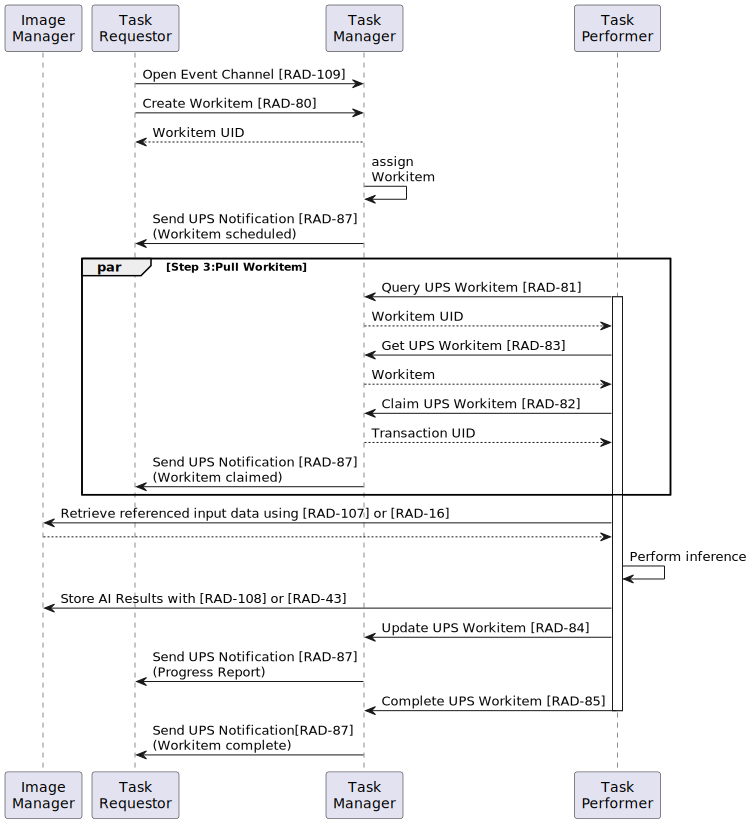

## UPS-RS

### Timeline of DICOM Specifications of Workflow Services
- 1993: [ACR-NEMA PS 3.4-1993: Detached Patient/Study/Results Management and Basic Study Content Notification Service Classes](https://dicom.nema.org/medical/dicom/1992-1995/PS3.4_1993.pdf)
- 1993: [Supp 10: Basic Worklist Management - Modality](https://dicom.nema.org/medical/dicom/Final/sup09_ft.pdf)
- 1996: [Supp 17: Modality Performed Procedure Step](https://dicom.nema.org/medical/dicom/Final/sup17_ft.pdf)
- 2000: [Supp 52: General Purpose Worklist](https://dicom.nema.org/medical/dicom/Final/sup52_ft.pdf)
- 2003: [Supp 93: Instance Availability Notification](https://dicom.nema.org/medical/dicom/Final/sup93_ft.pdf)
- 2004: [Supp 98: Retirement of Detached, Standalone and other Services](https://dicom.nema.org/medical/dicom/Final/sup98_ft.pdf)
- 2009: [Supp 96: Unified Worklist and Procedure Step](https://dicom.nema.org/medical/dicom/Final/sup96_ft.pdf)
- 2011: [Supp 158: Retirement of General Purpose Worklist and Procedure Step](https://dicom.nema.org/medical/dicom/Final/sup158_ft.pdf)
- 2014: [Supp 171: Unified Procedure Step by REpresentational State Transfer (REST) Services](https://dicom.nema.org/medical/dicom/Final/sup171_ft2.pdf)

### Sample Use Case: Pull Workflow
(Source: IHE Profile [AI Workflow for Imaging (AIW-I), Rev. 1.1 – 2020-08-06](https://www.ihe.net/uploadedFiles/Documents/Radiology/IHE_RAD_Suppl_AIW-I.pdf#page33))


### [Unified Procedure Step IOD (Information Object Definition) Modules](https://dicom.nema.org/medical/dicom/current/output/chtml/part03/sect_B.26.2.html)

- [SOP Common Module](#sop-common-module)
- [Unified Procedure Step Relationship Module](#unified-procedure-step-relationship-module)
- [Unified Procedure Step Scheduled Procedure Information Module](#unified-procedure-step-scheduled-procedure-information-module)
- [Unified Procedure Step Progress Information Module](#unified-procedure-step-progress-information-module)
- [Unified Procedure Step Performed Procedure Information Module](#unified-procedure-step-performed-procedure-information-module)
- [Patient Demographic Module](https://dicom.nema.org/medical/dicom/current/output/chtml/part03/sect_C.2.3.html) (optional)
- [Patient Medical Module](https://dicom.nema.org/medical/dicom/current/output/chtml/part03/sect_C.2.4.html) (optional)
- [Visit Identification Module](https://dicom.nema.org/medical/dicom/current/output/chtml/part03/sect_C.3.2.html) (optional)
- [Visit Status Module](https://dicom.nema.org/medical/dicom/current/output/chtml/part03/sect_C.3.3.html) (optional)
- [Visit Admission Module](https://dicom.nema.org/medical/dicom/current/output/chtml/part03/sect_C.3.4.html) (optional)

#### [SOP Common Module](https://dicom.nema.org/medical/dicom/current/output/chtml/part03/sect_C.12.html#sect_C.12.1)

| Attribute Name         | Tag         | Attribute Description                                                                          |
|------------------------|-------------|------------------------------------------------------------------------------------------------|
| Specific Character Set | (0008,0005) | Character Set that expands or replaces the Basic Graphic Set.                                  |
| SOP Class UID          | (0008,0016) | Uniquely identifies the Unified Procedure Step - Push SOP Class: `1.2.840.10008.5.1.4.34.6.1`. |
| SOP Instance UID       | (0008,0018) | Uniquely identifies the SOP Instance.                                                          |
| ..                     | ..          | ..                                                                                             |

#### [Unified Procedure Step Relationship Module](https://dicom.nema.org/medical/dicom/current/output/chtml/part03/sect_C.30.4.html)

| Attribute Name                    | Tag         | Attribute Description                                                                           |
|-----------------------------------|-------------|-------------------------------------------------------------------------------------------------|
| Patient's Name                    | (0010,0010) | Patient's full legal name.                                                                      |
| Patient ID                        | (0010,0020) | Primary identifier for the patient.                                                             |
| Referenced Request Sequence       | (0040,A370) | Requested Procedures to which the Procedure Step contributes.                                   |
| \>Study Instance UID              | (0020,000D) | Unique identifier for the Study.                                                                |
| \>Accession Number                | (0008,0050) | A departmental Information System generated number that identifies the Imaging Service Request. |
| \>Requested Procedure ID          | (0040,1001) | Identifier of the related Requested Procedure.                                                  |
| \>Requested Procedure Description | (0032,1060) | Institution-generated description or classification of the Requested Procedure.                 |
| Replaced Procedure Step Sequence  | (0074,1224) | Canceled procedure step(s) that are replaced by this procedure step.                            |
| \>Referenced SOP Class UID        | (0008,1150) | Uniquely identifies the Unified Procedure Step - Push SOP Class: `1.2.840.10008.5.1.4.34.6.1`.  |
| \>Referenced SOP Instance UID     | (0008,1155) | Uniquely identifies the referenced SOP Instance.                                                |
| ..                                | ..          | ..                                                                                              |

#### [Unified Procedure Step Scheduled Procedure Information Module](https://dicom.nema.org/medical/dicom/current/output/chtml/part03/sect_C.30.2.html)

| Attribute Name                                      | Tag         | Attribute Description                                                                                                               |
|-----------------------------------------------------|-------------|-------------------------------------------------------------------------------------------------------------------------------------|
| Scheduled Procedure Step Priority                   | (0074,1200) | Priority of the scheduled Procedure Step: `HIGH`, `MEDIUM` or `LOW`.                                                                |
| Scheduled Procedure Step Modification Date and Time | (0040,4010) | Date and time when the Scheduled Procedure Information was last modified or first created (whichever is most recent).               |
| Worklist Label                                      | (0074,1202) | A label identifying the worklist to which the Procedure Step Instance belongs.                                                      |
| Procedure Step Label                                | (0074,1204) | A label describing the task of the Procedure Step in text appropriate for displaying in the user selection interface.               |
| Scheduled Workitem Code Sequence                    | (0040,4018) | Coded description of the Procedure Step.                                                                                            |
| \>Code Value                                        | (0008,0100) | The identifier of the Coded Entry.                                                                                                  |
| \>Coding Scheme Designator                          | (0008,0102) | The identifier of the coding scheme in which the Coded Entry is defined.                                                            |
| \>Code Meaning                                      | (0008,0104) | Text that conveys the meaning of the Coded Entry.                                                                                   |
| Scheduled Processing Parameters Sequence            | (0074,1210) | Processing parameters to be used by the performing system when carrying out the Procedure Step.                                     |
| \>_Include Content Item Macro Attributes_           |             | [Coded Concept Name + Typed Value](https://dicom.nema.org/medical/dicom/current/output/chtml/part03/sect_10.2.html#table_10-2)      |
| Scheduled Station Name Code Sequence                | (0040,4025) | Identifying names within the enterprise of the equipment for which the Procedure Step is scheduled.                                 |
| \>Code Value                                        | (0008,0100) | The identifier of the Coded Entry.                                                                                                  |
| \>Coding Scheme Designator                          | (0008,0102) | The identifier of the coding scheme in which the Coded Entry is defined.                                                            |
| \>Code Meaning                                      | (0008,0104) | Text that conveys the meaning of the Coded Entry.                                                                                   |
| Scheduled Station Class Code Sequence               | (0040,4026) | Classes of the equipment for which the Procedure Step is scheduled.                                                                 |
| \>Code Value                                        | (0008,0100) | The identifier of the Coded Entry.                                                                                                  |
| \>Coding Scheme Designator                          | (0008,0102) | The identifier of the coding scheme in which the Coded Entry is defined.                                                            |
| \>Code Meaning                                      | (0008,0104) | Text that conveys the meaning of the Coded Entry.                                                                                   |
| Scheduled Station Geographic Location Code Sequence | (0040,4027) | Geographic locations of the equipment for which the Procedure Step is scheduled.                                                    |
| \>Code Value                                        | (0008,0100) | The identifier of the Coded Entry.                                                                                                  |
| \>Coding Scheme Designator                          | (0008,0102) | The identifier of the coding scheme in which the Coded Entry is defined.                                                            |
| \>Code Meaning                                      | (0008,0104) | Text that conveys the meaning of the Coded Entry.                                                                                   |
| Scheduled Human Performers Sequence                 | (0040,4034) | Human performers that are scheduled to be involved or responsible for performing the Procedure Step.                                |
| \>Human Performer Code Sequence                     | (0040,4009) | Human performer that is involved or responsible for performing the Procedure Step.                                                  |
| \>>Code Value                                       | (0008,0100) | The identifier of the Coded Entry.                                                                                                  |
| \>>Coding Scheme Designator                         | (0008,0102) | The identifier of the coding scheme in which the Coded Entry is defined.                                                            |
| \>>Code Meaning                                     | (0008,0104) | Text that conveys the meaning of the Coded Entry.                                                                                   |
| \>Human Performer's Name                            | (0040,4037) | Name of the human performer.                                                                                                        |
| \>Human Performer's Organization                    | (0040,4036) | Organization to which the human performer is accountable for the activities in the Procedure Step.                                  |
| Scheduled Procedure Step Start DateTime             | (0040,4005) | Date and time at which the Procedure Step is scheduled to start.                                                                    |
| Expected Completion DateTime                        | (0040,4011) | Date and time at which the Procedure Step  is expected to be completed.                                                             |
| Scheduled Procedure Step Expiration DateTime        | (0040,4008) | Date and time after which the Procedure Step is meaningless or undesirable.                                                         |
| Input Readiness State                               | (0040,4034) | Readiness state of the Input Information Sequence (0040,4021) and the referenced Instances. `INCOMPLETE`, `UNAVAILABLE` or `READY`. |
| Input Information Sequence                          | (0040,4021) | References to Information Objects needed to perform the scheduled Procedure Step.                                                   |
| \>Type of Instances                                 | (0040,E020) | Type of object Instances referenced. `DICOM`, `CDA`, `FHIR`, ..                                                                     |
| \>Study Instance UID                                | (0020,000D) | Unique identifier for the Study.                                                                                                    |
| \>Series Instance UID                               | (0020,000E) | Unique identifier for the Unique identifier for the Series that is part of the Study identified in Study Instance UID (0020,000D).  |
| \>Referenced SOP Sequence                           | (0008,1199) | References to object Instances.                                                                                                     |
| \>>Referenced SOP Class UID                         | (0008,1150) | Uniquely identifies the referenced SOP Class.                                                                                       |
| \>>Referenced SOP Instance UID                      | (0008,1155) | Uniquely identifies the referenced SOP Instance.                                                                                    |
| \>HL7 Instance Identifier                           | (0040,E001) | Instance Identifier of the encapsulated HL7 Structure Document.                                                                     |
| \>FHIR Logical ID                                   | (XXXX,YYY3) | Logical ID of the referenced FHIR resource instance.                                                                                |
| \>DICOM Retrieval Sequence                          | (0040,E021) | Details for retrieving Instances via the DICOM Retrieve Service.                                                                    |
| \>>Retrieve AE Title                                | (0008,0054) | Title of a DICOM Application Entity where the referenced Instance(s) may be retrieved on the network.                               |
| \>WADO Retrieval Sequence                           | (0040,E023) | Details for retrieving Instances available via WADO-URI.                                                                            |
| \>>Retrieve URI                                     | (0040,E010) | URI/URL specifying the location of the referenced Instance(s).                                                                      |
| \>XDS Retrieval Sequence                            | (0040,E024) | Details for retrieving Instances using the IHE XDS-I.b RAD-69 Transaction.                                                          |
| \>>Repository Unique ID                             | (0040,E030) | Uniquely identifies a Repository from which the referenced Instances can be retrieved.                                              |
| \>>Home Community ID                                | (0040,E031) | Uniquely identifies a Community to which requests for the referenced Instances can be directed.                                     |
| \>WADO-RS Retrieval Sequence                        | (0040,E025) | Details for retrieving Instances via WADO-RS.                                                                                       |
| \>>Retrieve URL                                     | (0008,1190) | URL specifying the location of the referenced Instance(s).                                                                          |
| \>FHIR Retrieval Sequence                           | (XXXX,YYYY) | Details for retrieving Instances via FHIR.                                                                                       |
| \>>Retrieve URL                                     | (0008,1190) | URL specifying the location of the referenced Instance(s).                                                                          |
| Study Instance UID                                  | (0020,000D) | Unique Study identification that shall be used for the created Composite SOP Instances resulting from this Unified Procedure Step.  |
| Output Destination Sequence                         | (0040,4070) | The destination to which the performer is requested to store the output objects generated.                                          |
| \>Referenced SOP Class UID                          | (0008,1150) | Required if the storage request only applies to a specific SOP Class.                                                               |
| \>DICOM Storage Sequence                            | (0040,4071) | Details for retrieving Instances via the DICOM Retrieve Service.                                                                    |
| \>>Destination AE                                   | (2100,0140) | Title of a DICOM Application Entity to which Instances will be stored.                                                              |
| \>STOW-RS Storage Sequence                          | (0040,4072) | Details for storing Instances via STOW-RS.                                                                                          |
| \>>Storage URL                                      | (0040,4073) | URI/URL specifying the location of the STOW-RS storage service to which Instances will be stored.                                   |
| \>XDS Storage Sequence                              | (0040,4074) | Details for storing Instances via the IHE Provide and Register Document Set-b (ITI-41) transaction.                                 |
| \>>Repository Unique ID                             | (0040,E030) | Uniquely identifies a Repository.                                                                                                   |
| \>>Home Community ID                                | (0040,E031) | Uniquely identifies a Community.                                                                                                    |
| ..                                                  | ..          | ..                                                                                                                                  |

#### [Unified Procedure Step Progress Information Module](https://dicom.nema.org/medical/dicom/current/output/chtml/part03/sect_C.30.html#sect_C.30.1)

| Attribute Name                               | Tag         | Attribute Description                                                                                                       |
|----------------------------------------------|-------------|-----------------------------------------------------------------------------------------------------------------------------|
| Procedure Step State                         | (0074,1000) | State of the Procedure Step. `SCHEDULED`, `IN PROGRESS`, `CANCELED` or `COMPLETED`.                                         |
| Progress Information Sequence                | (0074,1002) | Information about work progress for the Procedure Step.                                                                     |
| \>Procedure Step Progress                    | (0074,1004) | A numerical indicator of progress expressed as percentage complete.                                                         |
| \>Procedure Step Progress Description        | (0074,1006) | A textual description of progress.                                                                                          |
| \>Procedure Step Communications URI Sequence | (0074,1008) | Contact Information to communicate with performers of the Procedure Step.                                                   |
| \>>Contact URI                               | (0074,100A) | URI to communicate with performer of the procedure in progress.                                                             |
| \>>Contact Display Name                      | (0074,100C) | Name of the person, department or organization to contact for more information about the performance of the Procedure Step. |
| \>Procedure Step Cancellation DateTime       | (0040,4052) | Date and Time at which the procedure step was discontinued.                                                                 |
| \>Reason For Cancellation                    | (0074,1238) | A textual description of the reason a procedure step was discontinued.                                                      |
| ..                                           | ..          | ..                                                                                                                          |

#### [Unified Procedure Step Performed Procedure Information Module](https://dicom.nema.org/medical/dicom/current/output/chtml/part03/sect_C.30.3.html)

| Attribute Name                                        | Tag         | Attribute Description                                                                                                              |
|-------------------------------------------------------|-------------|------------------------------------------------------------------------------------------------------------------------------------|
| Unified Procedure Step Performed Procedure Sequence   | (0074,1216) | Details of the Procedure Step as performed.                                                                                        |
| \>Performed Workitem Code Sequence                    | (0040,4019) | A Sequence that conveys the type of procedure performed.                                                                           |
| \>>Code Value                                         | (0008,0100) | The identifier of the Coded Entry.                                                                                                 |
| \>>Coding Scheme Designator                           | (0008,0102) | The identifier of the coding scheme in which the Coded Entry is defined.                                                           |
| \>>Code Meaning                                       | (0008,0104) | Text that conveys the meaning of the Coded Entry.                                                                                  |
| \>Performed Processing Parameters Sequence            | (0074,1212) | Parameters used to perform the procedure.                                                                                          |
| \>>_Include Content Item Macro Attributes_            |             | [Coded Concept Name + Typed Value](https://dicom.nema.org/medical/dicom/current/output/chtml/part03/sect_10.2.html#table_10-2)     |
| \>Performed Station Name Code Sequence                | (0040,4028) | Names within the enterprise of the equipment that performed the Procedure Step.                                                    |
| \>>Code Value                                         | (0008,0100) | The identifier of the Coded Entry.                                                                                                 |
| \>>Coding Scheme Designator                           | (0008,0102) | The identifier of the coding scheme in which the Coded Entry is defined.                                                           |
| \>>Code Meaning                                       | (0008,0104) | Text that conveys the meaning of the Coded Entry.                                                                                  |
| \>Performed Station Class Code Sequence               | (0040,4029) | Classes of the equipment that created the Procedure Step.                                                                          |
| \>>Code Value                                         | (0008,0100) | The identifier of the Coded Entry.                                                                                                 |
| \>>Coding Scheme Designator                           | (0008,0102) | The identifier of the coding scheme in which the Coded Entry is defined.                                                           |
| \>>Code Meaning                                       | (0008,0104) | Text that conveys the meaning of the Coded Entry.                                                                                  |
| \>Performed Station Geographic Location Code Sequence | (0040,4030) | Geographic locations of the equipment that created Procedure Step.                                                                 |
| \>>Code Value                                         | (0008,0100) | The identifier of the Coded Entry.                                                                                                 |
| \>>Coding Scheme Designator                           | (0008,0102) | The identifier of the coding scheme in which the Coded Entry is defined.                                                           |
| \>>Code Meaning                                       | (0008,0104) | Text that conveys the meaning of the Coded Entry.                                                                                  |
| \>Actual Human Performers Sequence                    | (0040,4035) | Human performers that are/were actually involved or responsible for performing the Procedure Step.                                 |
| \>>Human Performer Code Sequence                      | (0040,4009) | Human performer that is involved or responsible for performing the Procedure Step.                                                 |
| \>>>Code Value                                        | (0008,0100) | The identifier of the Coded Entry.                                                                                                 |
| \>>>Coding Scheme Designator                          | (0008,0102) | The identifier of the coding scheme in which the Coded Entry is defined.                                                           |
| \>>>Code Meaning                                      | (0008,0104) | Text that conveys the meaning of the Coded Entry.                                                                                  |
| \>Performed Procedure Step Start DateTime             | (0040,4050) | Date and Time at which the Procedure Step started.                                                                                 |
| \>Performed Procedure Step End DateTime               | (0040,4051) | Date and Time at which the Procedure Step ended.                                                                                   |
| \>Output Information Sequence                         | (0040,4033) | References to information created as part of the Procedure Step.                                                                   |
| \>>Type of Instances                                  | (0040,E020) | Type of object Instances referenced. `DICOM`, `CDA`, `FHIR`. ..                                                                    |
| \>>Study Instance UID                                 | (0020,000D) | Unique identifier for the Study.                                                                                                   |
| \>>Series Instance UID                                | (0020,000E) | Unique identifier for the Unique identifier for the Series that is part of the Study identified in Study Instance UID (0020,000D). |
| \>>Referenced SOP Sequence                            | (0008,1199) | References to object Instances.                                                                                                    |
| \>>>Referenced SOP Class UID                          | (0008,1150) | Uniquely identifies the referenced SOP Class.                                                                                      |
| \>>>Referenced SOP Instance UID                       | (0008,1155) | Uniquely identifies the referenced SOP Instance.                                                                                   |
| \>>HL7 Instance Identifier                            | (0040,E001) | Instance Identifier of the encapsulated HL7 Structure Document.                                                                    |
| \>>FHIR Logical ID                                    | (XXXX,YYY3) | Logical ID of the referenced FHIR resource instance.                                                                               |
| \>>DICOM Retrieval Sequence                           | (0040,E021) | Details for retrieving Instances via the DICOM Retrieve Service.                                                                   |
| \>>>Retrieve AE Title                                 | (0008,0054) | Title of a DICOM Application Entity where the referenced Instance(s) may be retrieved on the network.                              |
| \>>WADO Retrieval Sequence                            | (0040,E023) | Details for retrieving Instances available via WADO-URI.                                                                           |
| \>>>Retrieve URI                                      | (0040,E010) | URI/URL specifying the location of the referenced Instance(s).                                                                     |
| \>>XDS Retrieval Sequence                             | (0040,E024) | Details for retrieving Instances using the IHE XDS-I.b RAD-69 Transaction.                                                         |
| \>>>Repository Unique ID                              | (0040,E030) | Uniquely identifies a Repository from which the referenced Instances can be retrieved.                                             |
| \>>>Home Community ID                                 | (0040,E031) | Uniquely identifies a Community to which requests for the referenced Instances can be directed.                                    |
| \>>WADO-RS Retrieval Sequence                         | (0040,E025) | Details for retrieving Instances via WADO-RS.                                                                                      |
| \>>>Retrieve URL                                      | (0008,1190) | URL specifying the location of the referenced Instance(s).                                                                         |
| ..                                                    | ..          | ..                                                                                                                                 |

### [Unified Procedure Step Service and SOP Classes (DIMSE Service)](https://dicom.nema.org/medical/dicom/current/output/html/part04.html#chapter_CC)

Defines 5 different SOP Classes bundling usage specific combinations of operations:

- [Unified Procedure Step - **Push** SOP Class](#unified-procedure-step---push-sop-class)
- [Unified Procedure Step - **Pull** SOP Class](#unified-procedure-step---pull-sop-class)
- [Unified Procedure Step - **Watch** SOP Class](#unified-procedure-step---watch-sop-class)
- [Unified Procedure Step - **Event** SOP Class](#unified-procedure-step---event-sop-class)
- [Unified Procedure Step - **Query** SOP Class](#unified-procedure-step---query-sop-class)
 
#### Unified Procedure Step - Push SOP Class

| Operation (DIMSE)             | Usage SCU/SCP |
|-------------------------------|---------------|
| Create UPS (N-CREATE)         | M/M           |
| Request UPS Cancel (N-ACTION) | U/M           |
| Get UPS Information (N-GET)   | U/M           |

#### Unified Procedure Step - Pull SOP Class

| Operation (DIMSE)           | Usage SCU/SCP |
|-----------------------------|---------------|
| Search for UPS (C-FIND)     | M/M           |
| Get UPS Information (N-GET) | M/M           |
| Update UPS (N-SET)          | M/M           |
| Change UPS State (N-ACTION) | M/M           |


> To take control of a `SCHEDULED` UPS, an SCU shall generate a Transaction UID and submit a state change to `IN PROGRESS`
including the Transaction UID in the submission. The SCU shall record and use the Transaction UID in future N-ACTION
and N-SET requests for that UPS instance.

| Attribute Name  | Tag         | Description                                                          |
|-----------------|-------------|----------------------------------------------------------------------|
| Transaction UID | (0008,1195) | UID to lock the UPS instance for getting processed by another actor. |

#### Unified Procedure Step - Watch SOP Class

| Operation (DIMSE)                                | Usage SCU/SCP |
|--------------------------------------------------|---------------|
| Un/Subscribe to Receive Event Reports (N-ACTION) | M/M           |
| Get UPS Information (N-GET)                      | M/M           |
| Search fo UPS (C-FIND)                           | U/M           |
| Request UPS Cancel (N-ACTION)                    | U/M           |

An SCU may Subscribe/Unsubscribe to Receive UPS Event Reports
- for an individual UPS instance
- for all UPS instances ("Global Subscription")
- for a subset of UPS instances matching specified keys ("Filtered Global Subscription")

To subscribe to Receive UPS Event Reports, the N-ACTION SCU has to specify

| Attribute Name | Tag         | Attribute Description                                                                             |
|----------------|-------------|---------------------------------------------------------------------------------------------------|
| Receiving AE   | (0074,1234) | AE Title of the N-EVENT-REPORT SCU to which UPS Event Reports shall be sent.                      |
| Deletion Lock  | (0074,1230) | Indicates if `COMPLETED` or `CANCELED` UPS instances shall **not** be deleted. `TRUE` or `FALSE`. |

#### Unified Procedure Step - Event SOP Class

| Operation (DIMSE)                              | Usage SCU/SCP |
|------------------------------------------------|---------------|
| Report a Change in UPS Status (N-EVENT-REPORT) | M/M           |

Event Types:

| Event Type Name      | Trigger                                                                                                                                                                                                                                                       |
|----------------------|---------------------------------------------------------------------------------------------------------------------------------------------------------------------------------------------------------------------------------------------------------------|
| UPS State Report     | - new UPS instance created <br> - change of _Procedure Step State (0074,1000)_ <br> - change of _Input Readiness State (0040,4041)_                                                                                                                           |
| UPS Cancel Requested | receive Request UPS Cancel (N-ACTION)                                                                                                                                                                                                                       |
| UPS Assigned         | - new UPS instance created <br> - change of _Scheduled Station Name Code Sequence (0040,4025)_ <br> - change of _Scheduled Human Performers Sequence (0040,4034)_                                                                                             |
| UPS Progress Report  | - change of _Procedure Step Progress (0074,1004)_ <br> - change of _Procedure Step Progress Description (0074,1006)_ <br> - change of _Procedure Step Communications URI Sequence (0074,1008)_                                                                |
| SCP Status Change    | restart of the SCP, specifying <br> - _SCP Status (0074,1242)_: `GOING DOWN` or `RESTARTED` <br> - _Subscription List Status (0074,1244)_: `WARM START` or `COLD START` <br> - _Unified Procedure Step List Status (0074,1246)_: `WARM START` or `COLD START` |

#### Unified Procedure Step - Query SOP Class

| Operation (DIMSE)      | Usage SCU/SCP |
|------------------------|---------------|
| Search fo UPS (C-FIND) | M/M           |

### [Worklist Service and Resources (DICOMWeb)](https://dicom.nema.org/medical/dicom/current/output/html/part18.html#chapter_11)

defines [10 Transactions](https://petstore.swagger.io/index.html?url=https://dcm4che.github.io/dicomweb/openapi.json#/UPS-RS)

- [Create Workitem Transaction](#create-workitem-transaction)
- [Retrieve Workitem Transaction](#retrieve-workitem-transaction)
- [Update Workitem Transaction](#update-workitem-transaction)
- [Change Workitem State](#change-workitem-state)
- [Request Cancellation](#request-cancellation)
- [Search Transaction](#search-transaction)
- [Subscribe Transaction](#subscribe-transaction)
- [Unsubscribe Transaction](#unsubscribe-transaction)
- [Suspend Global Subscription Transaction](#suspend-global-subscription-transaction)
- [Send Workitem Event Report Transaction](#send-workitem-event-report-transaction) (via WebSocket)

#### [Create Workitem Transaction](https://dicom.nema.org/medical/dicom/current/output/html/part18.html#sect_11.4)

[**`POST {baseURL}/workitems\[?workitem={workitem}\]`**](https://petstore.swagger.io/index.html?url=https://dcm4che.github.io/dicomweb/openapi.json#/UPS-RS/CreateWorkitem)

Workitem in payload encoded in
- `application/dicom+xml`
- `application/dicom+json`
- (`application/dicom`).

> The Workitem in the payload shall comply with all Instance requirements in the Req. Type N-CREATE column of
> [Table CC.2.5-3 “UPS SOP Class N-CREATE/N-SET/N-GET/C-FIND Attributes” in PS3.4](https://dicom.nema.org/medical/dicom/current/output/html/part04.html#table_CC.2.5-3).

E.g.:
```console
$ cat >> create-ups.xml << EOF
<?xml version="1.0" encoding="UTF-8"?>
<NativeDicomModel xml:space="preserve">
  <DicomAttribute keyword="AdmittingDiagnosesDescription" tag="00081080" vr="LO"/>
  <DicomAttribute keyword="AdmittingDiagnosesCodeSequence" tag="00081084" vr="SQ"/>
  <DicomAttribute keyword="TransactionUID" tag="00081195" vr="UI"/>
  <DicomAttribute keyword="PatientName" tag="00100010" vr="PN"/>
  <DicomAttribute keyword="PatientID" tag="00100020" vr="LO"/>
  <DicomAttribute keyword="PatientBirthDate" tag="00100030" vr="DA"/>
  <DicomAttribute keyword="PatientSex" tag="00100040" vr="CS"/>
  <DicomAttribute keyword="OtherPatientIDsSequence" tag="00101002" vr="SQ"/>
  <DicomAttribute keyword="AdmissionID" tag="00380010" vr="LO"/>
  <DicomAttribute keyword="IssuerOfAdmissionIDSequence" tag="00380014" vr="SQ"/>
  <DicomAttribute keyword="ScheduledProcedureStepStartDateTime" tag="00404005" vr="DT">
    <Value number="1">20240311112739.303640</Value>
  </DicomAttribute>
  <DicomAttribute keyword="ScheduledWorkitemCodeSequence" tag="00404018" vr="SQ"/>
  <DicomAttribute keyword="InputInformationSequence" tag="00404021" vr="SQ"/>
  <DicomAttribute keyword="ScheduledStationNameCodeSequence" tag="00404025" vr="SQ">
    <Item number="1">
      <DicomAttribute keyword="CodeValue" tag="00080100" vr="LO">
        <Value number="1">STATION-XY</Value>
      </DicomAttribute>
      <DicomAttribute keyword="CodingSchemeDesignator" tag="00080102" vr="LO">
        <Value number="1">99UPSRSDEMO24</Value>
      </DicomAttribute>
      <DicomAttribute keyword="CodeMeaning" tag="00080104" vr="LO">
        <Value number="1">Station XY</Value>
      </DicomAttribute>
    </Item>
  </DicomAttribute>
  <DicomAttribute keyword="ScheduledStationClassCodeSequence" tag="00404026" vr="SQ"/>
  <DicomAttribute keyword="ScheduledStationGeographicLocationCodeSequence" tag="00404027" vr="SQ"/>
  <DicomAttribute keyword="ScheduledHumanPerformersSequenceCodeSequence" tag="00404034" vr="SQ"/>
  <DicomAttribute keyword="InputReadinessState" tag="00404041" vr="CS">
    <Value number="1">UNAVAILABLE</Value>
  </DicomAttribute>
  <DicomAttribute keyword="ReferencedRequestSequence" tag="0040A370" vr="SQ"/>
  <DicomAttribute keyword="ProcedureStepState" tag="00741000" vr="CS">
    <Value number="1">SCHEDULED</Value>
  </DicomAttribute>
  <DicomAttribute keyword="ProcedureStepProgressInformationSequence" tag="00741002" vr="SQ"/>
  <DicomAttribute keyword="ScheduledProcedureStepPriority" tag="00741200" vr="CS">
    <Value number="1">MEDIUM</Value>
  </DicomAttribute>
  <DicomAttribute keyword="WorklistLabel" tag="00741202" vr="LO">
    <Value number="1">WorklistX</Value>
  </DicomAttribute>
  <DicomAttribute keyword="ProcedureStepLabel" tag="00741204" vr="LO">
    <Value number="1">TaskY</Value>
  </DicomAttribute>
  <DicomAttribute keyword="ScheduledProcessingParametersSequence" tag="00741210" vr="SQ"/>
  <DicomAttribute keyword="UnifiedProcedureStepPerformedProcedureSequence" tag="00741216" vr="SQ"/>
</NativeDicomModel>
EOF
```
```console
$ curl -vH 'Content-Type: application/dicom+xml' -d @create-ups.xml http://localhost:8080/dcm4chee-arc/aets/WORKLIST/rs/workitems
> POST /dcm4chee-arc/aets/WORKLIST/rs/workitems/ HTTP/1.1
> Host: localhost:8080
> User-Agent: curl/7.81.0
> Accept: */*
> Content-Type: application/dicom+xml
> Content-Length: 2125
> 

< HTTP/1.1 201 Created
< Location: http://localhost:8080/dcm4chee-arc/aets/WORKLIST/rs/workitems/2.25.68891579261869033145962963425485462514
```

Or with `application/dicom+json` encoded Workitem and specified SOP Instance UID:

E.g.:
```console
$ cat >> create-ups.json << EOF
[
  {
    "00081080": {
      "vr": "LO"
    },
    "00081084": {
      "vr": "SQ"
    },
    "00081195": {
      "vr": "UI"
    },
    "00100010": {
      "vr": "PN"
    },
    "00100020": {
      "vr": "LO"
    },
    "00100030": {
      "vr": "DA"
    },
    "00100040": {
      "vr": "CS"
    },
    "00101002": {
      "vr": "SQ"
    },
    "00380010": {
      "vr": "LO"
    },
    "00380014": {
      "vr": "SQ"
    },
    "00404005": {
      "vr": "DT",
      "Value": [
        "20240311112739.303640"
      ]
    },
    "00404018": {
      "vr": "SQ"
    },
    "00404021": {
      "vr": "SQ"
    },
    "00404025": {
      "vr": "SQ",
      "Value": [
        {
          "00080100": {
            "vr": "LO",
            "Value": [
              "STATION-XY"
            ]
          }
        },
        {
          "00080100": {
            "vr": "LO",
            "Value": [
              "99UPSRSDEMO24"
            ]
          }
        },
        {
          "00080100": {
            "vr": "LO",
            "Value": [
              "Station XY"
            ]
          }
        }
      ]
    },
    "00404026": {
      "vr": "SQ"
    },
    "00404027": {
      "vr": "SQ"
    },
    "00404034": {
      "vr": "SQ"
    },
    "00404041": {
      "vr": "CS",
      "Value": [
        "UNAVAILABLE"
      ]
    },
    "0040A370": {
      "vr": "SQ"
    },
    "00741000": {
      "vr": "CS",
      "Value": [
        "SCHEDULED"
      ]
    },
    "00741002": {
      "vr": "SQ"
    },
    "00741200": {
      "vr": "CS",
      "Value": [
        "MEDIUM"
      ]
    },
    "00741202": {
      "vr": "LO",
      "Value": [
        "WorklistX"
      ]
    },
    "00741204": {
      "vr": "LO",
      "Value": [
        "TaskY"
      ]
    },
    "00741210": {
      "vr": "SQ"
    },
    "00741216": {
      "vr": "SQ"
    }
  }
]
EOF
```
```console
$ curl -vH 'Content-Type: application/dicom+json' -d @create-ups.json http://localhost:8080/dcm4chee-arc/aets/WORKLIST/rs/workitems?workitem=1.2.3.4
> POST /dcm4chee-arc/aets/WORKLIST/rs/workitems?workitem=1.2.3.4 HTTP/1.1
> Host: localhost:8080
> User-Agent: curl/7.81.0
> Accept: */*
> Content-Type: application/dicom+json
> Content-Length: 1130
> 

< HTTP/1.1 201 Created
< Location: http://localhost:8080/dcm4chee-arc/aets/WORKLIST/rs/workitems/1.2.3.4 
```

#### [Retrieve Workitem Transaction](https://dicom.nema.org/medical/dicom/current/output/html/part18.html#sect_11.5)

- [**`GET {baseURL}/workitems/{workitem}`**](https://petstore.swagger.io/index.html?url=https://dcm4che.github.io/dicomweb/openapi.json#/UPS-RS/RetrieveWorkitem)

E.g.:
```console
$ curl -v -H 'Accept: application/dicom+xml' http://localhost:8080/dcm4chee-arc/aets/WORKLIST/rs/workitems/1.2.3.4 | xmllint - --format
> GET /dcm4chee-arc/aets/WORKLIST/rs/workitems/1.2.3.4 HTTP/1.1
> Host: localhost:8080
> User-Agent: curl/7.81.0
> Accept: application/dicom+xml
> 

< HTTP/1.1 200 OK
< Date: Mon, 11 Mar 2024 12:52:15 GMT
< Transfer-Encoding: chunked
< Content-Type: application/dicom+xml
< 
{ [2380 bytes data]

<?xml version="1.0" encoding="UTF-8"?>
<NativeDicomModel xml:space="preserve">
  <DicomAttribute keyword="SOPClassUID" tag="00080016" vr="UI">
    <Value number="1">1.2.840.10008.5.1.4.34.6.1</Value>
  </DicomAttribute>
  <DicomAttribute keyword="SOPInstanceUID" tag="00080018" vr="UI">
    <Value number="1">1.2.3.4</Value>
  </DicomAttribute>
  <DicomAttribute keyword="AdmittingDiagnosesDescription" tag="00081080" vr="LO"/>
  <DicomAttribute keyword="AdmittingDiagnosesCodeSequence" tag="00081084" vr="SQ"/>
  <DicomAttribute keyword="PatientName" tag="00100010" vr="PN"/>
  <DicomAttribute keyword="PatientID" tag="00100020" vr="LO"/>
  <DicomAttribute keyword="PatientBirthDate" tag="00100030" vr="DA"/>
  <DicomAttribute keyword="PatientSex" tag="00100040" vr="CS"/>
  <DicomAttribute keyword="OtherPatientIDsSequence" tag="00101002" vr="SQ"/>
  <DicomAttribute keyword="AdmissionID" tag="00380010" vr="LO"/>
  <DicomAttribute keyword="IssuerOfAdmissionIDSequence" tag="00380014" vr="SQ"/>
  <DicomAttribute keyword="ScheduledProcedureStepStartDateTime" tag="00404005" vr="DT">
    <Value number="1">20240311112739.303640</Value>
  </DicomAttribute>
  <DicomAttribute keyword="ScheduledProcedureStepModificationDateTime" tag="00404010" vr="DT">
    <Value number="1">20240311112739.303640</Value>
  </DicomAttribute>
  <DicomAttribute keyword="ScheduledWorkitemCodeSequence" tag="00404018" vr="SQ"/>
  <DicomAttribute keyword="InputInformationSequence" tag="00404021" vr="SQ"/>
  <DicomAttribute keyword="ScheduledStationNameCodeSequence" tag="00404025" vr="SQ">
    <Item number="1">
      <DicomAttribute keyword="CodeValue" tag="00080100" vr="LO">
        <Value number="1">STATION-XY</Value>
      </DicomAttribute>
      <DicomAttribute keyword="CodingSchemeDesignator" tag="00080102" vr="LO">
        <Value number="1">99UPSRSDEMO24</Value>
      </DicomAttribute>
      <DicomAttribute keyword="CodeMeaning" tag="00080104" vr="LO">
        <Value number="1">Station XY</Value>
      </DicomAttribute>
    </Item>
  </DicomAttribute>
  <DicomAttribute keyword="ScheduledStationClassCodeSequence" tag="00404026" vr="SQ"/>
  <DicomAttribute keyword="ScheduledStationGeographicLocationCodeSequence" tag="00404027" vr="SQ"/>
  <DicomAttribute keyword="ScheduledHumanPerformersSequenceCodeSequence" tag="00404034" vr="SQ"/>
  <DicomAttribute keyword="InputReadinessState" tag="00404041" vr="CS">
    <Value number="1">UNAVAILABLE</Value>
  </DicomAttribute>
  <DicomAttribute keyword="ReferencedRequestSequence" tag="0040A370" vr="SQ"/>
  <DicomAttribute keyword="ProcedureStepState" tag="00741000" vr="CS">
    <Value number="1">SCHEDULED</Value>
  </DicomAttribute>
  <DicomAttribute keyword="ProcedureStepProgressInformationSequence" tag="00741002" vr="SQ"/>
  <DicomAttribute keyword="ScheduledProcedureStepPriority" tag="00741200" vr="CS">
    <Value number="1">MEDIUM</Value>
  </DicomAttribute>
  <DicomAttribute keyword="WorklistLabel" tag="00741202" vr="LO">
    <Value number="1">WorklistX</Value>
  </DicomAttribute>
  <DicomAttribute keyword="ProcedureStepLabel" tag="00741204" vr="LO">
    <Value number="1">TaskY</Value>
  </DicomAttribute>
  <DicomAttribute keyword="ScheduledProcessingParametersSequence" tag="00741210" vr="SQ"/>
  <DicomAttribute keyword="UnifiedProcedureStepPerformedProcedureSequence" tag="00741216" vr="SQ"/>
</NativeDicomModel>
```

Or with `application/dicom+json` encoded Workitem:
```console
$ curl -v -H 'Accept: application/dicom+json' http://localhost:8080/dcm4chee-arc/aets/WORKLIST/rs/workitems/1.2.3.4 | jq
> GET /dcm4chee-arc/aets/WORKLIST/rs/workitems/1.2.3.4 HTTP/1.1
> Host: localhost:8080
> User-Agent: curl/7.81.0
> Accept: application/dicom+json
> 
* Mark bundle as not supporting multiuse
< HTTP/1.1 200 OK
< Date: Mon, 11 Mar 2024 12:54:34 GMT
< Transfer-Encoding: chunked
< Content-Type: application/dicom+json
< 
{ [787 bytes data]

[
  {
    "00080016": {
      "vr": "UI",
      "Value": [
        "1.2.840.10008.5.1.4.34.6.1"
      ]
    },
    "00080018": {
      "vr": "UI",
      "Value": [
        "1.2.3.4"
      ]
    },
    "00081080": {
      "vr": "LO"
    },
    "00081084": {
      "vr": "SQ"
    },
    "00100010": {
      "vr": "PN"
    },
    "00100020": {
      "vr": "LO"
    },
    "00100030": {
      "vr": "DA"
    },
    "00100040": {
      "vr": "CS"
    },
    "00101002": {
      "vr": "SQ"
    },
    "00380010": {
      "vr": "LO"
    },
    "00380014": {
      "vr": "SQ"
    },
    "00404005": {
      "vr": "DT",
      "Value": [
        "20240311112739.303640"
      ]
    },
    "00404010": {
      "vr": "DT",
      "Value": [
        "20240311112739.303640"
      ]
    },
    "00404018": {
      "vr": "SQ"
    },
    "00404021": {
      "vr": "SQ"
    },
    "00404025": {
      "vr": "SQ",
      "Value": [
        {
          "00080100": {
            "vr": "LO",
            "Value": [
              "STATION-XY"
            ]
          }
        },
        {
          "00080100": {
            "vr": "LO",
            "Value": [
              "99UPSRSDEMO24"
            ]
          }
        },
        {
          "00080100": {
            "vr": "LO",
            "Value": [
              "Station XY"
            ]
          }
        }
      ]
    },
    "00404026": {
      "vr": "SQ"
    },
    "00404027": {
      "vr": "SQ"
    },
    "00404034": {
      "vr": "SQ"
    },
    "00404041": {
      "vr": "CS",
      "Value": [
        "UNAVAILABLE"
      ]
    },
    "0040A370": {
      "vr": "SQ"
    },
    "00741000": {
      "vr": "CS",
      "Value": [
        "SCHEDULED"
      ]
    },
    "00741002": {
      "vr": "SQ"
    },
    "00741200": {
      "vr": "CS",
      "Value": [
        "MEDIUM"
      ]
    },
    "00741202": {
      "vr": "LO",
      "Value": [
        "WorklistX"
      ]
    },
    "00741204": {
      "vr": "LO",
      "Value": [
        "TaskY"
      ]
    },
    "00741210": {
      "vr": "SQ"
    },
    "00741216": {
      "vr": "SQ"
    }
  }
]
```

#### [Update Workitem Transaction](https://dicom.nema.org/medical/dicom/current/output/html/part18.html#sect_11.6)

- [**`POST {baseURL}/workitems/{workitem}`**](https://petstore.swagger.io/index.html?url=https://dcm4che.github.io/dicomweb/openapi.json#/UPS-RS/UpdateWorkitem)

> The request payload contains a dataset with the changes to the target Workitem. The dataset shall include all
> elements that are to be modified. All modifications to the Workitem shall comply with all requirements described in
> [Section CC.2.6.2 in PS3.4](https://dicom.nema.org/medical/dicom/current/output/html/part04.html#sect_CC.2.6.2).

E.g.:
```console
$ cat >> update-ups.xml << EOF
<?xml version="1.0" encoding="UTF-8"?>
<NativeDicomModel xml:space="preserve">
  <DicomAttribute keyword="InputInformationSequence" tag="00404021" vr="SQ">
    <Item number="1">
      <DicomAttribute keyword="TypeOfInstances" tag="0040E020" vr="CS">
        <Value number="1">DICOM</Value>
      </DicomAttribute>
      <DicomAttribute keyword="StudyInstanceUID" tag="0020000D" vr="UI">
        <Value number="1">1.2.3.4.5</Value>
      </DicomAttribute>
      <DicomAttribute keyword="SeriesInstanceUID" tag="0020000E" vr="UI">
        <Value number="1">1.2.3.4.5.6</Value>
      </DicomAttribute>
      <DicomAttribute keyword="ReferencedSOPSequence" tag="00081199" vr="SQ">
        <Item number="1">
          <DicomAttribute keyword="Referenced SOP Class UID" tag="00081150" vr="UI">
            <Value number="1">1.2.840.10008.5.1.4.1.1.1</Value>
          </DicomAttribute>
          <DicomAttribute keyword="ReferencedSOPInstanceUID" tag="00081155" vr="UI">
            <Value number="1">1.2.3.4.5.6.7</Value>
          </DicomAttribute>
        </Item>
      </DicomAttribute>
    </Item>
  </DicomAttribute>
  <DicomAttribute keyword="InputReadinessState" tag="00404041" vr="CS">
    <Value number="1">READY</Value>
  </DicomAttribute>
</NativeDicomModel>
EOF
```
```console
$ curl -vH 'Content-Type: application/dicom+xml' -d @update-ups.xml http://localhost:8080/dcm4chee-arc/aets/WORKLIST/rs/workitems/1.2.3.4
> POST /dcm4chee-arc/aets/WORKLIST/rs/workitems/1.2.3.4 HTTP/1.1
> Host: localhost:8080
> User-Agent: curl/7.81.0
> Accept: */*
> Content-Type: application/dicom+xml
> Content-Length: 1226
> 

< HTTP/1.1 200 OK
```
#### [Change Workitem State](https://dicom.nema.org/medical/dicom/current/output/html/part18.html#sect_11.7)

- [**`PUT {baseURL}/workitems/{workitem}/state/{performer}`**](https://petstore.swagger.io/index.html?url=https://dcm4che.github.io/dicomweb/openapi.json#/UPS-RS/ChangeWorkitemState)

with

| Attribue Name         | Tag          | Description                                                                    |
|-----------------------|--------------|--------------------------------------------------------------------------------|
| Transaction UID       | (0008,1195)  | UID to lock the UPS instance for getting processed by another actor.           |
| Procedure Step State  | (0074,1000)  | Changed State of the Procedure Step. `IN PROGRESS`, `CANCELED` or `COMPLETED`. |

in the Payload.

E.g.:
```console
$ cat >> claim-ups.xml << EOF
<?xml version="1.0" encoding="UTF-8"?>
<NativeDicomModel xml:space="preserve">
  <DicomAttribute keyword="TransactionUID" tag="00081195" vr="UI">
    <Value number="1">1.2.3.4.5.6.7.8</Value>
  </DicomAttribute>
  <DicomAttribute keyword="ProcedureStepState" tag="00741000" vr="CS">
    <Value number="1">IN PROGRESS</Value>
  </DicomAttribute>
</NativeDicomModel>
EOF
```
```console
$ curl -v -H 'Content-type: application/dicom+xml' -T claim-ups.xml http://localhost:8080/dcm4chee-arc/aets/WORKLIST/rs/workitems/1.2.3.4/state/UPSSCU
> PUT /dcm4chee-arc/aets/WORKLIST/rs/workitems/1.2.3.4/state/UPSSCU HTTP/1.1
> Host: localhost:8080
> User-Agent: curl/7.81.0
> Accept: */*
> Content-type: application/dicom+xml
> Content-Length: 359
> Expect: 100-continue
>
< HTTP/1.1 100 Continue
* We are completely uploaded and fine
< HTTP/1.1 200 OK
```

After changing the _Procedure Step State (0074,1000)_ to `IN PROGRESS`, the (matching)
_Transaction UID (0008,1195)_ has also be specified for further updating the UPS instance.

E.g.:
```console
$ cat >> progress-ups.xml << EOF
<?xml version="1.0" encoding="UTF-8"?>
<NativeDicomModel xml:space="preserve">
  <DicomAttribute keyword="TransactionUID" tag="00081195" vr="UI">
    <Value number="1">1.2.3.4.5.6.7.8</Value>
  </DicomAttribute>
  <DicomAttribute keyword="ProcedureStepProgressInformationSequence" tag="00741002" vr="SQ">
    <Item number="1">
      <DicomAttribute keyword="ProcedureStepProgress" tag="00741004" vr="DS">
        <Value number="1">50</Value>
      </DicomAttribute>
    </Item>
  </DicomAttribute>
</NativeDicomModel>
```
```console
$ curl -v -H 'Content-type: application/dicom+xml' -d @progress-ups.xml http://localhost:8080/dcm4chee-arc/aets/WORKLIST/rs/workitems/1.2.3.4
> POST /dcm4chee-arc/aets/WORKLIST/rs/workitems/1.2.3.4 HTTP/1.1
> Host: localhost:8080
> User-Agent: curl/7.81.0
> Accept: */*
> Content-type: application/dicom+xml
> Content-Length: 505
> 
< HTTP/1.1 200 OK
```

#### [Request Cancellation](https://dicom.nema.org/medical/dicom/current/output/html/part18.html#sect_11.8)

- [**`POST {baseURL}/workitems/{workitem}/cancelrequest/{requestor}`**](https://petstore.swagger.io/index.html?url=https://dcm4che.github.io/dicomweb/openapi.json#/UPS-RS/RequestWorkitemCancellation)

Optionally 

| Attribute Name                                      | Tag         | Description                                                                     |
|-----------------------------------------------------|-------------|---------------------------------------------------------------------------------|
| Reason For Cancellation                             | (0074,1238) | A textual description of the reason a procedure step was discontinued.          |
| Procedure Step Discontinuation Reason Code Sequence | (0074,100E) | Coded Reason(s) for Discontinuing the Procedure Step.                           |
| \>Code Value                                        | (0008,0100) | The identifier of the Coded Entry.                                              |
| \>Coding Scheme Designator                          | (0008,0102) | The identifier of the coding scheme in which the Coded Entry is defined.        |
| \>Code Meaning                                      | (0008,0104) | Text that conveys the meaning of the Coded Entry.                               |
| Contact URI                                         | (0074,100A) | URI to communicate with the requestor                                           |
| Contact Display Name                                | (0074,100C) | Name of the person, department or organization to contact for more information. |

can be specified in the payload.

```console
$ curl -v -X POST 'http://localhost:8080/dcm4chee-arc/aets/WORKLIST/rs/workitems/1.2.3.4/cancelrequest/CANCEL_REQUESTOR'
> POST /dcm4chee-arc/aets/WORKLIST/rs/workitems/1.2.3.4/cancelrequest/CANCEL_REQUESTOR HTTP/1.1
> Host: localhost:8080
> User-Agent: curl/7.81.0
> Accept: */*
> 
< HTTP/1.1 202 Accepted
```

#### [Search Transaction](https://dicom.nema.org/medical/dicom/current/output/html/part18.html#sect_11.9)

- [**`GET {baseURL}/workitems`**](https://petstore.swagger.io/index.html?url=https://dcm4che.github.io/dicomweb/openapi.json#/UPS-RS/SearchForWorkitems)

>For each matching Workitem, the origin server shall include in the results:
>
>    All Unified Procedure Step Instance Attributes in [Table CC.2.5-3 “UPS SOP Class N-CREATE/N-SET/N-GET/C-FIND Attributes” in PS3.4](https://dicom.nema.org/medical/dicom/current/output/html/part04.html#table_CC.2.5-3) with a Return Key Type of 1 or 2.

E.g. query for all Workitems in progress encoded in `multipart/related;type="application/dicom+xml"`:
```console
$ curl -v -H 'Accept: multipart/related;type="application/dicom+xml"' http://localhost:8080/dcm4chee-arc/aets/WORKLIST/rs/workitems?ProcedureStepState=IN+PROGRESS
> GET /dcm4chee-arc/aets/WORKLIST/rs/workitems?ProcedureStepState=IN+PROGRESS HTTP/1.1
> Host: localhost:8080
> User-Agent: curl/7.81.0
> Accept: multipart/related;type="application/dicom+xml"
> 
< HTTP/1.1 200 OK
< Transfer-Encoding: chunked
< Content-Type: multipart/related;start="<8b92a7b6-e986-4410-9b89-31739df4244c@resteasy-multipart>";type="application/dicom+xml"; boundary=b6d926b6-bf80-4e65-9836-b62ae3aec781
< 
{ [3723 bytes data]
--b6d926b6-bf80-4e65-9836-b62ae3aec781
Content-ID: <8b92a7b6-e986-4410-9b89-31739df4244c@resteasy-multipart>
Content-Type: application/dicom+xml

<?xml version="1.0" encoding="UTF-8"?><NativeDicomModel xml:space="preserve">...</<NativeDicomModel>
--b6a6c4c0-adfd-40ea-a530-ad4683cb6e47
Content-ID: <1e05cd68-3100-45c2-9281-0c833cc094ea@resteasy-multipart>
Content-Type: application/dicom+xml

<?xml version="1.0" encoding="UTF-8"?><NativeDicomModel xml:space="preserve">...</<NativeDicomModel>
:
--b6a6c4c0-adfd-40ea-a530-ad4683cb6e47--
```

#### [Subscribe Transaction](https://dicom.nema.org/medical/dicom/current/output/html/part18.html#sect_11.10)

- [**`POST {baseURL}/workitems/{workitem}/subscribers/{subscriber}`**](https://petstore.swagger.io/index.html?url=https://dcm4che.github.io/dicomweb/openapi.json#/UPS-RS/SubscribeWorkitem) - Subscribe to Workitem
- [**`POST {baseURL}/workitems/1.2.840.10008.5.1.4.34.5/subscribers/{subscriber}`**](https://petstore.swagger.io/index.html?url=https://dcm4che.github.io/dicomweb/openapi.json#/UPS-RS/SubscribeWorklist) - Subscribe to Worklist
- [**`POST {baseURL}/workitems/1.2.840.10008.5.1.4.34.5.1/subscribers/{subscriber}`**](https://petstore.swagger.io/index.html?url=https://dcm4che.github.io/dicomweb/openapi.json#/UPS-RS/SubscribeFilteredWorklist) - Subscribe to Filtered Worklist

E.g. subscribe `UPSSCU` with Deletion Lock to receive Event Reports related to UPS instances with
_Worklist Label (0074,1202)_ = `WorklistX`:
```console
$ curl -v -X POST 'http://localhost:8080/dcm4chee-arc/aets/WORKLIST/rs/workitems/1.2.840.10008.5.1.4.34.5.1/subscribers/UPSSCU?deletionlock=true&WorklistLabel=WorklistX'
> POST /dcm4chee-arc/aets/WORKLIST/rs/workitems/1.2.840.10008.5.1.4.34.5.1/subscribers/UPSSCU?deletionlock=true&WorklistLabel=WorklistX HTTP/1.1
> Host: localhost:8080
> User-Agent: curl/7.81.0
> Accept: */*
> 
< HTTP/1.1 201 Created
< Location: ws://localhost:8080/dcm4chee-arc/aets/WORKLIST/ws/subscribers/UPSSCU
```

#### [Unsubscribe Transaction](https://dicom.nema.org/medical/dicom/current/output/html/part18.html#sect_11.11)

- [**`DELETE {baseURL}/workitems/{workitem}/subscribers/{subscriber}`**](https://petstore.swagger.io/index.html?url=https://dcm4che.github.io/dicomweb/openapi.json#/UPS-RS/UnsubscribeWorkitem) - Unsubscribe from Workitem
- [**`DELETE {baseURL}/workitems/1.2.840.10008.5.1.4.34.5/subscribers/{subscriber}`**](https://petstore.swagger.io/index.html?url=https://dcm4che.github.io/dicomweb/openapi.json#/UPS-RS/UnsubscribeWorklist) - Unsubscribe from Worklist
- [**`DELETE {baseURL}/workitems/1.2.840.10008.5.1.4.34.5.1/subscribers/{subscriber}`**](https://petstore.swagger.io/index.html?url=https://dcm4che.github.io/dicomweb/openapi.json#/UPS-RS/UnsubscribeFilteredWorklist) - Unsubscribe from Filtered Worklist

E.g. Delete Subscription of `UPSSCU` from Filtered Worklist:
```console
$ curl -v -X DELETE 'http://localhost:8080/dcm4chee-arc/aets/WORKLIST/rs/workitems/1.2.840.10008.5.1.4.34.5.1/subscribers/UPSSCU'
> DELETE /dcm4chee-arc/aets/WORKLIST/rs/workitems/1.2.840.10008.5.1.4.34.5.1/subscribers/UPSSCU HTTP/1.1
> Host: localhost:8080
> User-Agent: curl/7.81.0
> Accept: */*
> 
< HTTP/1.1 200 OK
```

#### [Suspend Global Subscription Transaction](https://dicom.nema.org/medical/dicom/current/output/html/part18.html#sect_11.12)

- [**`POST {baseURL}/workitems/1.2.840.10008.5.1.4.34.5/subscribers/{subscriber}/suspend`**](https://petstore.swagger.io/index.html?url=https://dcm4che.github.io/dicomweb/openapi.json#/UPS-RS/SuspendSubscriptionWorklist) - Suspend Subscription from Worklist
- [**`POST {baseURL}/workitems/1.2.840.10008.5.1.4.34.5.1/subscribers/{subscriber}/suspend`**](https://petstore.swagger.io/index.html?url=https://dcm4che.github.io/dicomweb/openapi.json#/UPS-RS/SuspendSubscriptionFilteredWorklist) - Suspend Subscription from Filtered Worklist

E.g. Suspend Subscription of `UPSSCU` from Filtered Worklist:
```console
$ curl -v -X POST 'http://localhost:8080/dcm4chee-arc/aets/WORKLIST/rs/workitems/1.2.840.10008.5.1.4.34.5.1/subscribers/UPSSCU/suspend'
> POST /dcm4chee-arc/aets/WORKLIST/rs/workitems/1.2.840.10008.5.1.4.34.5.1/subscribers/UPSSCU/suspend HTTP/1.1
> Host: localhost:8080
> User-Agent: curl/7.81.0
> Accept: */*
> 
< HTTP/1.1 200 OK
```

#### [Send Workitem Event Report Transaction](https://dicom.nema.org/medical/dicom/current/output/html/part18.html#sect_11.13)

A client has to open a Web Socket connection, to be able to receive Event Reports encoded in `application/dicom+json`,
e.g.:
```console
$ wscat -c  ws://localhost:8080/dcm4chee-arc/aets/WORKLIST/ws/subscribers/UPSSCU
Connected (press CTRL+C to quit)
```

There are 5 different types of Event Reports:

- [UPS State Report](#ups-state-report)
- [UPS Cancel Requested](#ups-cancel-requested)
- [UPS Progress Report](#ups-progress-report)
- [SCP Status Change](#scp-status-change)
- [UPS Assigned](#ups-assigned)

##### UPS State Report

Triggered on
- creation of new UPS instances 
- change of _Procedure Step State (0074,1000)_
- change of _Input Readiness State (0040,4041)_

| Attribute Name                                      | Tag         | Required                         |
|-----------------------------------------------------|-------------|----------------------------------|
| Affected SOP Class UID                              | (0000,0002) | Y (= 1.2.840.10008.5.1.4.34.6.1) |
| Message ID                                          | (0000,0101) | Y                                |
| Affected SOP Instance UID                           | (0000,1000) | Y                                |
| Event Type ID                                       | (0000,1000) | Y (= 1)                          |
| Procedure Step State                                | (0074,1000) | Y                                |
| Input Readiness State                               | (0040,4034) | Y                                |
| Reason For Cancellation                             | (0074,1238) | C                                |
| Procedure Step Discontinuation Reason Code Sequence | (0074,100E) | C                                |
| \>Code Value                                        | (0008,0100) | C                                |
| \>Coding Scheme Designator                          | (0008,0102) | C                                |
| \>Code Meaning                                      | (0008,0104) | C                                |

E.g.:
```json
{
  "00000002": {
    "vr": "UI",
    "Value": [
      "1.2.840.10008.5.1.4.34.6.1"
    ]
  },
  "00000110": {
    "vr": "US",
    "Value": [
      2
    ]
  },
  "00001000": {
    "vr": "UI",
    "Value": [
      "1.2.3.4"
    ]
  },
  "00001002": {
    "vr": "US",
    "Value": [
      1
    ]
  },
  "00404041": {
    "vr": "CS",
    "Value": [
      "UNAVAILABLE"
    ]
  },
  "00741000": {
    "vr": "CS",
    "Value": [
      "SCHEDULED"
    ]
  }
}
```

##### UPS Cancel Requested

Triggered on [Request Cancellation](#request-cancellation).

| Attribute Name                                      | Tag         | Required                           |
|-----------------------------------------------------|-------------|------------------------------------|
| Affected SOP Class UID                              | (0000,0002) | Y (= 1.2.840.10008.5.1.4.34.6.1)   |
| Message ID                                          | (0000,0101) | Y                                  |
| Affected SOP Instance UID                           | (0000,1000) | Y                                  |
| Event Type ID                                       | (0000,1000) | Y (= 2)                            |
| Requesting AE                                       | (0074,1236) | Y (= `{requestor}` path parameter) |
| Reason For Cancellation                             | (0074,1238) | C (= copy request)                 |
| Procedure Step Discontinuation Reason Code Sequence | (0074,100E) | C (= copy request)                 |
| \>Code Value                                        | (0008,0100) | C (= copy request)                 |
| \>Coding Scheme Designator                          | (0008,0102) | C (= copy request)                 |
| \>Code Meaning                                      | (0008,0104) | C (= copy request)                 |
| Contact URI                                         | (0074,100A) | C (= copy request)                 |
| Contact Display Name                                | (0074,100C) | C (= copy request)                 |

E.g.:
```json
{
  "00000002": {
    "vr": "UI",
    "Value": [
      "1.2.840.10008.5.1.4.34.6.1"
    ]
  },
  "00000110": {
    "vr": "US",
    "Value": [
      5
    ]
  },
  "00001000": {
    "vr": "UI",
    "Value": [
      "1.2.3.4"
    ]
  },
  "00001002": {
    "vr": "US",
    "Value": [
      2
    ]
  },
  "00741236": {
    "vr": "AE",
    "Value": [
      "CANCEL_REQUESTOR"
    ]
  }
}
```

##### UPS Progress Report

Triggered on
- change of _Procedure Step Progress (0074,1004)_
- change of _Procedure Step Progress Description (0074,1006)_
- change of _Procedure Step Communications URI Sequence (0074,1008)_

| Attribute Name                               | Tag         | Required                         |
|----------------------------------------------|-------------|----------------------------------|
| Affected SOP Class UID                       | (0000,0002) | Y (= 1.2.840.10008.5.1.4.34.6.1) |
| Message ID                                   | (0000,0101) | Y                                |
| Affected SOP Instance UID                    | (0000,1000) | Y                                |
| Event Type ID                                | (0000,1000) | Y (= 3)                          |
| Procedure Step Progress Information Sequence | (0074,1002) | Y                                |
| \>Procedure Step Progress                    | (0074,1004) | C                                |
| \>Procedure Step Progress Description        | (0074,1006) | C                                |
| \>Procedure Step Communications URI Sequence | (0074,1008) | C                                |
| \>>Contact URI                               | (0074,100A) | C                                |
| \>>Contact Display Name                      | (0074,100C) | C                                |

E.g.:
```json
{
  "00000002": {
    "vr": "UI",
    "Value": [
      "1.2.840.10008.5.1.4.34.6.1"
    ]
  },
  "00000110": {
    "vr": "US",
    "Value": [
      19
    ]
  },
  "00001000": {
    "vr": "UI",
    "Value": [
      "1.2.3.4"
    ]
  },
  "00001002": {
    "vr": "US",
    "Value": [
      3
    ]
  },
  "00741002": {
    "vr": "SQ",
    "Value": [
      {
        "00741004": {
          "vr": "DS",
          "Value": [
            "50"
          ]
        }
      }
    ]
  }
}
```

##### SCP Status Change

Triggered on
- shutdown of the Worklist Service
- restart of the Worklist Service

| Attribute Name                     | Tag         | Required                           |
|------------------------------------|-------------|------------------------------------|
| Affected SOP Class UID             | (0000,0002) | Y (= 1.2.840.10008.5.1.4.34.6.1)   |
| Message ID                         | (0000,0101) | Y                                  |
| Affected SOP Instance UID          | (0000,1000) | Y                                  |
| Event Type ID                      | (0000,1000) | Y (= 4)                            |
| SCP Status                         | (0074,1242) | Y (= `GOING DOWN` or `RESTARTED`)  |
| Subscription List Status           | (0074,1244) | C (= `WARM START` or `COLD START`) |
| Unified Procedure Step List Status | (0074,1246) | C (= `WARM START` or `COLD START`) |

E.g.:
```json
{
  "00000002": {
    "vr": "UI",
    "Value": [
      "1.2.840.10008.5.1.4.34.6.1"
    ]
  },
  "00000110": {
    "vr": "US",
    "Value": [
      25
    ]
  },
  "00001000": {
    "vr": "UI",
    "Value": [
      "1.2.840.10008.5.1.4.34.5.1"
    ]
  },
  "00001002": {
    "vr": "US",
    "Value": [
      4
    ]
  },
  "00741242": {
    "vr": "CS",
    "Value": [
      "GOING DOWN"
    ]
  }
}
```
```json
{
  "00000002": {
    "vr": "UI",
    "Value": [
      "1.2.840.10008.5.1.4.34.6.1"
    ]
  },
  "00000110": {
    "vr": "US",
    "Value": [
      29
    ]
  },
  "00001000": {
    "vr": "UI",
    "Value": [
      "1.2.840.10008.5.1.4.34.5.1"
    ]
  },
  "00001002": {
    "vr": "US",
    "Value": [
      4
    ]
  },
  "00741242": {
    "vr": "CS",
    "Value": [
      "RESTARTED"
    ]
  },
  "00741244": {
    "vr": "CS",
    "Value": [
      "WARM START"
    ]
  },
  "00741246": {
    "vr": "CS",
    "Value": [
      "WARM START"
    ]
  }
}
```

##### UPS Assigned

Triggered on
- creation of new UPS instances with non-empty Scheduled Station Name Code Sequence (0040,4025)_ or
  _Scheduled Human Performers Sequence (0040,4034)_
- change of _Scheduled Station Name Code Sequence (0040,4025)_
- change of _Scheduled Human Performers Sequence (0040,4034)_

| Attribute Name                       | Tag         | Required                         |
|--------------------------------------|-------------|----------------------------------|
| Affected SOP Class UID               | (0000,0002) | Y (= 1.2.840.10008.5.1.4.34.6.1) |
| Message ID                           | (0000,0101) | Y                                |
| Affected SOP Instance UID            | (0000,1000) | Y                                |
| Event Type ID                        | (0000,1000) | Y (= 5)                          |
| Scheduled Station Name Code Sequence | (0040,4025) | C                                |
| \>Code Value                         | (0008,0100) | C                                |
| \>Coding Scheme Designator           | (0008,0102) | C                                |
| \>Code Meaning                       | (0008,0104) | C                                |
| Human Performer Code Sequence        | (0040,4009) | C                                |
| \>Code Value                         | (0008,0100) | C                                |
| \>Coding Scheme Designator           | (0008,0102) | C                                |
| \>Code Meaning                       | (0008,0104) | C                                |
| Human Performer's Organization       | (0040,4036) | C                                |

E.g.:
```json
{
  "00000002": {
    "vr": "UI",
    "Value": [
      "1.2.840.10008.5.1.4.34.6.1"
    ]
  },
  "00000110": {
    "vr": "US",
    "Value": [
      15
    ]
  },
  "00001000": {
    "vr": "UI",
    "Value": [
      "1.2.3.4"
    ]
  },
  "00001002": {
    "vr": "US",
    "Value": [
      5
    ]
  },
  "00404025": {
    "vr": "SQ",
    "Value": [
      {
        "00080100": {
          "vr": "LO",
          "Value": [
            "STATION-XY"
          ]
        }
      },
      {
        "00080100": {
          "vr": "LO",
          "Value": [
            "99UPSRSDEMO24"
          ]
        }
      },
      {
        "00080100": {
          "vr": "LO",
          "Value": [
            "Station XY"
          ]
        }
      }
    ]
  }
}
```

### IHE Profiles making use of UPS
- [Post-Acquisition Workflow (PAWF), Rev. 1.1 – 2012-06-15](https://www.ihe.net/Technical_Framework/upload/IHE_RAD_Suppl_PAWF_Rev1-1_TI_2012-06-15.pdf)
  - Actors
    - Workitem Creator
    - Workitem Manager
    - Workitem Performer
    - Watcher
  - Transactions
    - RAD-80: Create UPS Workitem
    - RAD-81: Query UPS Workitems
    - RAD-82: Claim UPS Workitem
    - RAD-83: Get UPS Workitem
    - RAD-84: Update UPS Workitem
    - RAD-85: Complete UPS Workitem
    - RAD-86: Manage UPS Subscription
    - RAD-87: Send UPS Notification
    - RAD-88: Request UPS Cancelation
- [Radiology Remote Reading Workflow (RRR-WF), Rev. 1.1 – 2015-12-14](https://www.ihe.net/uploadedFiles/Documents/Radiology/IHE_RAD_Supp_RRR-WF.pdf)
  - Actors
    - Task Requestor
    - Task Manager
    - Task Performer
    - Watcher
  - Transactions
    - RAD-80: Create UPS Workitem (DIMSE or RESTful)
    - RAD-81: Query UPS Workitems (DIMSE or RESTful)
    - RAD-82: Claim UPS Workitem (DIMSE or RESTful)
    - RAD-83: Get UPS Workitem (DIMSE or RESTful)
    - RAD-84: Update UPS Workitem (DIMSE or RESTful)
    - RAD-85: Complete UPS Workitem (DIMSE or RESTful)
    - RAD-86: Manage UPS Subscription (DIMSE or RESTful)
    - RAD-87: Send UPS Notification (DIMSE or RESTful)
    - RAD-88: Request UPS Cancelation (DIMSE or RESTful)
    - RAD-109: Open Event Channel (DIMSE or RESTful)
- [Encounter-Based Imaging Workflow (EBIW), Rev. 2.1 – 2019-05-13](https://www.ihe.net/uploadedFiles/Documents/Radiology/IHE_RAD_Suppl_EBIW.pdf)
  - >_Encounter-based Imaging_ : The capture of medical images and associated data in the context of a patient
    > encounter, such as an office visit. This is in contrast to Order-Based Imaging where imaging is captured
    > in the context of an ordered procedure. Patient encounters can involve a patient going to a physician location,
    > or a physician going to a patient location. Appointments represent anticipated encounters.
  - Actors
    - Encounter Manager
    - Lightweight Modality
  - Transaction
    - RAD-130: Get Encounter Imaging Context (MWL or UPS-RS) with [mappings from MWL attributes to UPS attributes](https://www.ihe.net/uploadedFiles/Documents/Radiology/IHE_RAD_Suppl_EBIW.pdf#page=61).
- [AI Workflow for Imaging (AIW-I), Rev. 1.1 – 2020-08-06](https://www.ihe.net/uploadedFiles/Documents/Radiology/IHE_RAD_Suppl_AIW-I.pdf)
  - Same Actors and Transactions as Radiology Remote Reading Workflow (RRR-WF)
